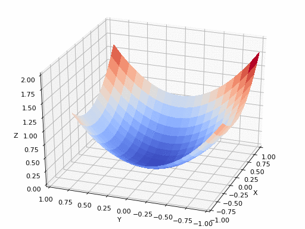
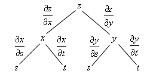

# Session 1 - Feed Forward Network (Basics)

## Objective:

Rewrite the Colab file and:
- remove the last activation function
- make sure there are in total 44 parameters
- run it for 2001 epochs
- Add a readme file to your project and describe these things:
- What is a neural network neuron?
- What is the use of the learning rate?
- How are weights initialized?
- What is "loss" in a neural network?
- What is the "chain rule" in gradient flow?
- This assignment is worth 300pts (150 for Code, and 150 for your readme file (directly proportional to your description).

[](https://colab.research.google.com/github/pankaj90382/END-1.0/blob/main/S1/END2.0%20Session%201.ipynb)

## Solution

1. What is a "neuron" in a neural network

A neuron is the fundamental block of any deep learning network, they can be thought of being analogous to a human brain neuron.


> `input <-> dendrites` : responsible to receive the input from a previous neuron or from a sensor like that of an image sensor.

> `calculation/activation <-> soma` : this is where the actual computation happends, all the inputs are put together and a signal (output/spike) is generated. In an ANN this can be an activation function like Sigmoid, ReLU, TanH etc.

> `output <-> axon` : the output from the activation is carries onto the next neuron layer.

2. What is the use of Learning Rate ?



Learning Rate reduces the loss step by step so that network reaches to the lowest point of our concave plot. The "step" allowed the model to learn about more towards the input data and reduces the chances of error. Smaller steps will leads to a longer time to achieve highest accuracy whereas longer steps might misses the lowest point of error. These steps are called the Learning Rate.

There are various learning rate schedulers to help with the step size, like `StepLR`, `MultiStepLR`, `ExponentialLR`, `CyclicLR`, `OneCycleLR`, etc.

3. How are weights initialized ?

There are many ways to initialize a network parameters. [Pytorch Weights Intialization](https://pytorch.org/docs/stable/nn.init.html)

- Uniform Distribution
- Normal Distribution
- Dirac Delta Function
- Xavier Uniform Distribution
- Xavier Normal Distribution
- Kaiming Uniform Distribution
- Kaiming Normal Distribution

The Data Science organizations majorly follows the Kaiming and Xavier initialization. [Want to Know Why Check this.](https://pouannes.github.io/blog/initialization/) The initalizations which never need to follow is to assign zero to all your weights otherwise network suffers during the backprop, the derivative w.r.t to the loss function is the same for every weight, this makes the hidden units symmetric, thus there is no non-linearity in the deep learning model, this makes it no different than a linear model, hence zero initialization is never really used.

Some Examples of Weights Initialization in Pytorch:-
```python
def reset_parameters(self) -> None:
    init.kaiming_uniform_(self.weight, a=math.sqrt(5))
    if self.bias is not None:
        fan_in, _ = init._calculate_fan_in_and_fan_out(self.weight)
        bound = 1 / math.sqrt(fan_in)
        init.uniform_(self.bias, -bound, bound)
```

4. What is "loss" in a neural network ?

`Inputs (x) -> Neural Network -> Output (y^)`, Generally in the neural network the inputs passed down to the model to generate expected outputs which is in this case `y^` and then to train the network, the expected output compared with ground truth of the input `x` ie `y`, then to update the weights of the network, loss is calulated which can simply be defined as (`y^` - `y`), the value provides the idea how far network's output from the ground truth. There are various loss functions options we have, namely, `Mean Square Error Loss`, `Binary CrossEntropy Loss`, `CrossEntropy Loss`, `KL Divergence Loss`, `L1 Loss`, `Huber Loss`, etc.

All of these loss function have their purpose (based on the type on inputs to the network, based on the learning rate you want), and affects how the neural network learns.

5. What is the "chain rule" in gradient flow ?

Before trying to understand the chain rule, let's first try to understand what is a "gradient" in a gradient flow.

So basically our main goal is to redule the "loss" of the output, to do that we use gradient. Do you remember gradient, divergence, and curl from Engineering Maths ? :') should have payed more attention then, these terms are really really important.

The gradient of a vector can be interpreted as the "direction and rate of the fastest increase". If the gradient of a function is non-zero at a point p, the direction of the gradient in which the function increases most quickly from p, and the magnitude of the gradient is the rate of increase in that direction, the greatest absolute directional derivative.

<div align="center">

</div>

And also you must be wondering how the partial derivatives came in, this `grad` was the reason so,

Here would be `grad L` (gradient of Loss)

<div align="center">

</div>

Now does it make all sense?  Since the `grad F` gives the direction of highest increase, we multiple this `grad F` by `-ve 1`, thus now we have the direction of highest decrease in the loss value, and we thus move towards that steepest decreasing loss! amazing right?

<div align="center">

</div>

But what is this chain rule?

The problem is that  may not be directly calculatable.

`w0 -> i_0 -> activation -> o_0`

`w0`: weight 0
`i_0`: multiply the weights with output of previous layer, this is input to this neuron
`activation`: a activation function is applied to `i_0` producing `o_0`

This is the chain rule from maths

<div align="center">

</div>

see how 

Similarly,

<div align="center">

</div>

That's the chain rule, plain and simple

## Refrences

Tensorflow Playground: [http://playground.tensorflow.org/](http://playground.tensorflow.org/)
