# Session 11 Language Translation using Seq2Seq Multiple Attention Mechanism

## Objective

1. Follow the similar strategy as in session [baby-steps-code](https://colab.research.google.com/drive/1IlorkvXhZgmd_sayOVx4bC_I5Qpdzxk_?usp=sharing), but replace GRU with LSTM. In your code you must:
  * Perform 1 full feed forward step for the encoder manually
  * Perform 1 full feed forward step for the decoder manually.
  * You can use any of the 3 attention mechanisms (Generalized Attention, Loung Attention, Bahdanau Attention) as discussed. 

## Solution
[](https://githubtocolab.com/pankaj90382/END-1.0/blob/main/S11/Seq2seq_Translation_Step_by_Step_Guide.ipynb)

### Approach

In this exercise, I have developed LSTM with Bahdanau Attention, and LSTM to work out the complete single sentence through the model without using for loop. Ideally it should managed by the pytorch to go through all the loop mechanism with the batches however its good practice to develop it from scratch rather than taking the code from existing libraries.

## LSTM + Bahdanau Attention with baby-steps

### Sample
Select a pair of senetences from the data we prepared since in this code did not have used the any for loop. Defining the sentence will restrict the random pair which ultimately effect Max_word length.

```python
# sample = random.choice(pairs)
sample = ['vous me faites rougir .', 'you re making me blush .']
sample
```
```
['vous me faites rougir .', 'you re making me blush .']
```

In order to work with embedding layer and the LSTM the inputs should be in the form of tensor, So we need to convert the sentences(words) to tensors.<br>
First we'll split the sentences by whitespaces and convert each words into indices(using word2index[word])

```python
input_sentence = sample[0]
output_sentence = sample[1]
input_indices = [input_lang.word2index[word] for word in input_sentence.split(' ')]
target_indices = [output_lang.word2index[word] for word in output_sentence.split(' ')]
input_indices, target_indices
    ([118, 27, 590, 2795, 5], [129, 78, 505, 343, 1655, 4])
    
input_indices.append(EOS_token)
target_indices.append(EOS_token)
input_indices, target_indices
   ([118, 27, 590, 2795, 5, 1], [129, 78, 505, 343, 1655, 4, 1])
```

Then convert the input_indices into tensors

```python
input_tensor = torch.tensor(input_indices, dtype=torch.long, device = device)
output_tensor = torch.tensor(target_indices, dtype=torch.long, device = device)
input_tensor.shape, output_tensor.shape
   (torch.Size([6]), torch.Size([7]))
```

### Dimensions of Layers

```python
DIM_IN = input_lang.n_words
DIM_OUT = output_lang.n_words
DIM_HID = 256 # arbitraily chosen! must be same for encoder and decoder!
MAX_LEN_IN = input_tensor.size()[0] # length of the input sequence under consideration
MAX_LEN_OUT = output_tensor.size()[0] # length of the output sequence under consideration
DIM_IN, DIM_OUT, DIM_HID, MAX_LEN_IN, MAX_LEN_OUT
   (4345, 2803, 256, 6, 7)
```


### Encoder
#### LSTM Layer
We create an LSTM layer for use in the encoder

```python
embedding = nn.Embedding(DIM_IN, DIM_HID).to(device)
lstm = nn.LSTM(DIM_HID, DIM_HID).to(device)
```

#### Intitial states

The initial hidden/cell states of the LSTM are initialized to zeros.

```python
encoder_outputs = torch.zeros(MAX_LEN_IN, DIM_HID, device=device) # array to store outputs of enocders so that it can be used for attention
hidden = torch.zeros(1, 1, DIM_HID, device=device) # first hidden state initialized as zeros
cell = torch.zeros(1, 1, DIM_HID, device=device) # first hidden state initialized as zeros
```

#### First Encoder output

For the first word, we get the embeddings of the first word , and feed the lstm layer with it and the initial hidden/cell states.

```python
input = input_tensor[0].view(-1, 1)
embedded_input = embedding(input)
output, (hidden, cell) = lstm(embedded_input, (hidden, cell))
encoder_outputs[0] += output[0,0]
print('Step %d\nWord => %s\n'%(0,input_sentence.split(' ')[0]))
print(embedded_input.shape, output.shape,hidden.shape,cell.shape)
plot_func(embedded_input, output, input_sentence.split(' ')[0])
```

#### Second Encoder output

For the first word, we get the embeddings of the second word, and feed the lstm layer with it and the hidden/cell states obtained from the first word.
```python
input = input_tensor[1].view(-1, 1)
embedded_input = embedding(input)
output, (hidden, cell) = lstm(embedded_input, (hidden, cell))
encoder_outputs[1] += output[0,0]
```

#### Remaining Outputs

The step above is repeated for the entire input sequence.


### Decoder

#### Layers

```python
embedding = nn.Embedding(DIM_OUT, DIM_HID).to(device)
attn = nn.Linear(DIM_HID, DIM_HID)
lstm_inp = nn.Linear(DIM_HID * 2, DIM_HID).to(device) #this layer takes care of the mismatched dimensions
lstm = nn.LSTM(DIM_HID, DIM_HID).to(device)
linear_out = nn.Linear(DIM_HID*2, DIM_OUT).to(device)
```


#### First output

For the first word, we get the embeddings of the first word , and feed the lstm layer with it and the initial hidden/cell states.


```python
decoder_input = torch.tensor([[SOS_token]], device=device) # We start from the <SOS> Token
decoder_hidden = hidden # what we got from the output of the encoder from the last word
decoder_cell = cell # what we got from the output of the encoder from the last word
print('\nStep %d'%(0))
print('Expected output(word) => %s '% output_sentence.split(" ")[0])
print('Expected output(Index) => %d '% target_indices[0])
embedded = embedding(decoder_input)
print('Decoder Embedding shape',embedded.shape)
## Attn module
attn_energies = torch.zeros(MAX_LEN_IN).to(device)
for i in range(MAX_LEN_IN):
  energy = attn(encoder_outputs[i])
  attn_energies[i] = hidden[0,0].dot(energy) + cell[0,0].dot(energy)
attn_weights = F.softmax(attn_energies, dim=0).unsqueeze(0).unsqueeze(0)
##

context = attn_weights.bmm(encoder_outputs.unsqueeze(1).transpose(0, 1))

input_to_lstm1 = torch.cat((embedded, context), 2)
input_to_lstm2 = lstm_inp(input_to_lstm1)
output, (decoder_hidden, decoder_cell) = lstm(input_to_lstm2, (decoder_hidden, decoder_cell))

output = F.log_softmax(linear_out(torch.cat((output, context), 2)), dim=2)
top_value, top_index = output.data.topk(1) # same as using np.argmax

out_word = output_lang.index2word[top_index.item()]
print('Predicted output(word) => %s '% out_word)
print('Predicted output(Index) => %d '% top_index.item())
attention_plot(attn_weights)
predicted_sentence.append(out_word)
```


#### Second Output

Again teacher forcing is randomly chosen. 

```python
teacher_forcing_ratio = 0.5
use_teacher_forcing = True if random.random() < teacher_forcing_ratio else False

if use_teacher_forcing:
  decoder_input = torch.tensor([[target_indices[0]]], device=device)
else:
  decoder_input = torch.tensor([[top_index.item()]], device=device)
```

Once decided, then this input is then fed to the LSTM.


```python
embedded = embedding(decoder_input)
print('\nStep %d'%(1))
print('Expected output(word) => %s '% output_sentence.split(" ")[1])
print('Expected output(Index) => %d '% target_indices[1])
## Attn module
attn_energies = torch.zeros(MAX_LEN_IN).to(device)
for i in range(MAX_LEN_IN):
  energy = attn(encoder_outputs[i])
  attn_energies[i] = hidden[0,0].dot(energy) + cell[0,0].dot(energy)
attn_weights = F.softmax(attn_energies, dim=0).unsqueeze(0).unsqueeze(0)
##

context = attn_weights.bmm(encoder_outputs.unsqueeze(1).transpose(0, 1))

input_to_lstm1 = torch.cat((embedded, context), 2)
input_to_lstm2 = lstm_inp(input_to_lstm1)
output, (decoder_hidden, decoder_cell) = lstm(input_to_lstm2, (decoder_hidden, decoder_cell))

output = F.log_softmax(linear_out(torch.cat((output, context), 2)), dim=2)
top_value, top_index = output.data.topk(1) # same as using np.argmax

out_word = output_lang.index2word[top_index.item()]
print('Predicted output(word) => %s '% out_word)
print('Predicted output(Index) => %d '% top_index.item())
attention_plot(attn_weights)
predicted_sentence.append(out_word)
```


#### Remaining Outputs

The step above is repeated for the entire output sequence.

#### Output

Finally, all the outputs are concatenated to form a sentence. 

```python
predicted_sentence = ' '.join(predicted_sentence)
predicted_sentence
```
```
absolute concerns mobile volunteering volunteering situation mobile
```
The resulting sentence will not make sense since the lstm/embedding layers were initialized randomly. Training/backpropagation is needed to generate a proper sentence.


## LSTM Babay-Steps-Code

Most of the code is similar to the first part. The only difference is the way the attention is calculated that affects the layers and their dimensions.
### Sample

Since we are not allowed loops, a random sample from the data has been chosen so that the maximum length of input/output sequences over which we have to proceed does not change. The sample is 

```python
sample = ['vous me faites rougir .', 'you re making me blush .']
```
### Dimensions of Layers

```python
DIM_IN = input_lang.n_words
DIM_OUT = output_lang.n_words
DIM_HID = 256 # arbitraily chosen! must be same for encoder and decoder!
MAX_LEN_IN = input_tensor.size()[0] # length of the input sequence under consideration
MAX_LEN_OUT = output_tensor.size()[0] # length of the output sequence under consideration
```

## Encoder

#### LSTM Layer
We create an LSTM layer for use in the encoder

```python
embedding = nn.Embedding(DIM_IN, DIM_HID).to(device)
lstm = nn.LSTM(DIM_HID, DIM_HID).to(device)
```

#### Intitial states

The initial hidden/cell states of the LSTM are initialized to zeros.

```python
encoder_outputs = torch.zeros(MAX_LEN_IN, DIM_HID, device=device) # array to store outputs of enocders so that it can be used for attention
hidden = torch.zeros(1, 1, DIM_HID, device=device) # first hidden state initialized as zeros
cell = torch.zeros(1, 1, DIM_HID, device=device) # first hidden state initialized as zeros
```

#### First output

For the first word, we get the embeddings of the first word , and feed the lstm layer with it and the initial hidden/cell states.

```python
input = input_tensor[0].view(-1, 1)
embedded_input = embedding(input)
output, (hidden, cell) = lstm(embedded_input, (hidden, cell))
encoder_outputs[0] += output[0,0]
print('Step %d\nWord => %s\n'%(0,input_sentence.split(' ')[0]))
print(embedded_input.shape, output.shape,hidden.shape,cell.shape)
plot_func(embedded_input, output, input_sentence.split(' ')[0])
```

#### Second output

For the first word, we get the embeddings of the second word, and feed the lstm layer with it and the hidden/cell states obtained from the first word.
```python
input = input_tensor[1].view(-1, 1)
embedded_input = embedding(input)
output, (hidden, cell) = lstm(embedded_input, (hidden, cell))
encoder_outputs[1] += output[0,0]
print('Step %d\nWord => %s\n'%(1,input_sentence.split(' ')[1]))
print(embedded_input.shape, output.shape,hidden.shape,cell.shape)
plot_func(embedded_input, output, input_sentence.split(' ')[1])
```

#### Remaining Outputs

The step above is repeated for the entire input sequence.


### Decoder

#### LSTM Layer
We create an LSTM layer for use in the decoder

```python
lstm = nn.LSTM(DIM_HID, DIM_HID).to(device)
```
#### Attention Weights Layer
This layer captures the attention weights. Unlike the in-class code, here we will concatenate the embeddings with the hidden as well as the cell state. Hence, it would be thrice the hidden dimension, rather than twice!

```python
attn_weigts_layer = nn.Linear(DIM_HID * 3, MAX_LEN_IN).to(device)
```
#### Intitial states

The initial hidden/cell states of the LSTM are obtained from the output of the encoder LSTM.

```python
decoder_hidden = hidden # what we got from the output of the encoder from the last word
decoder_cell = cell # what we got from the output of the encoder from the last word
```


#### First output

For the first word, we get the embeddings of the first word , and feed the lstm layer with it and the initial hidden/cell states.

```python
decoder_input = torch.tensor([[SOS_token]], device=device) # We start from the <SOS> Token
decoder_hidden = hidden # what we got from the output of the encoder from the last word
decoder_cell = cell # what we got from the output of the encoder from the last word

embedded = embedding(decoder_input)
print('\nStep %d'%(0))
print('Expected output(word) => %s '% output_sentence.split(" ")[0])
print('Expected output(Index) => %d '% target_indices[0])
# This decides the values with which output from the encoder needs weighed!
attn_weigts_layer_input = torch.cat((embedded[0], decoder_hidden[0], cell[0]), 1)
attn_weights = attn_weigts_layer(attn_weigts_layer_input)
attn_weights = F.softmax(attn_weights, dim = 1)

# This calculates the attention values!
attn_applied = torch.bmm(attn_weights.unsqueeze(0), encoder_outputs.unsqueeze(0))

input_to_lstm = lstm_inp(torch.cat((embedded[0], attn_applied[0]), 1))
input_to_lstm = input_to_lstm.unsqueeze(0)
output, (decoder_hidden, decoder_cell) = lstm(input_to_lstm, (decoder_hidden, decoder_cell))
output = F.relu(output)

output = F.softmax(linear_out(output[0]), dim = 1)
top_value, top_index = output.data.topk(1) # same as using np.argmax
out_word = output_lang.index2word[top_index.item()]
print('Predicted output(word) => %s '% out_word)
print('Predicted output(Index) => %d '% top_index.item())
attention_plot(attn_weights)
predicted_sentence.append(out_word)
```

#### Second output

For the first word, we randomly choose whether or not to implement teacher forcing. If we do, the input will be the target word. If not, it will be the output of the previous run of the lstm in the decoder

```python
teacher_forcing_ratio = 0.5
use_teacher_forcing = True if random.random() < teacher_forcing_ratio else False

if use_teacher_forcing:
  decoder_input = torch.tensor([[target_indices[0]]], device=device)
else:
  decoder_input = torch.tensor([[top_index.item()]], device=device)
```
This input is then fed to the LSTM.

```python
embedded = embedding(decoder_input)
print('\nStep %d'%(1))
print('Expected output(word) => %s '% output_sentence.split(" ")[1])
print('Expected output(Index) => %d '% target_indices[1])
# This decides the values with which output from the encoder needs weighed!
attn_weigts_layer_input = torch.cat((embedded[0], decoder_hidden[0], cell[0]), 1)
attn_weights = attn_weigts_layer(attn_weigts_layer_input)
attn_weights = F.softmax(attn_weights, dim = 1)

# This calculates the attention values!
attn_applied = torch.bmm(attn_weights.unsqueeze(0), encoder_outputs.unsqueeze(0))

input_to_lstm = lstm_inp(torch.cat((embedded[0], attn_applied[0]), 1))
input_to_lstm = input_to_lstm.unsqueeze(0)
output, (decoder_hidden, decoder_cell) = lstm(input_to_lstm, (decoder_hidden, decoder_cell))
output = F.relu(output)

output = F.softmax(linear_out(output[0]), dim = 1)
top_value, top_index = output.data.topk(1) # same as using np.argmax
out_word = output_lang.index2word[top_index.item()]
print('Predicted output(word) => %s '% out_word)
print('Predicted output(Index) => %d '% top_index.item())
attention_plot(attn_weights)
predicted_sentence.append(out_word)
```

#### Remaining Outputs

The step above is repeated for the entire output sequence.

#### Output

Finally, all the outputs are concatenated to form a sentence. 

```python
predicted_sentence = ' '.join(predicted_sentence)
predicted_sentence
```
```
depth desk desk desk desk desk desk
```
The resulting sentence will not make sense since the lstm/embedding layers were initialized randomly. Training/backpropagation is needed to generate a proper sentence.

## Results of each Step

### LSTM + Bahdanau Attention

| Steps| Encoder | Decoder |
|--|--|--|
|0| Step 0 <br> Word => vous <br>  <br> torch.Size([1, 1, 256]) torch.Size([1, 1, 256]) torch.Size([1, 1, 256]) torch.Size([1, 1, 256]) <br> 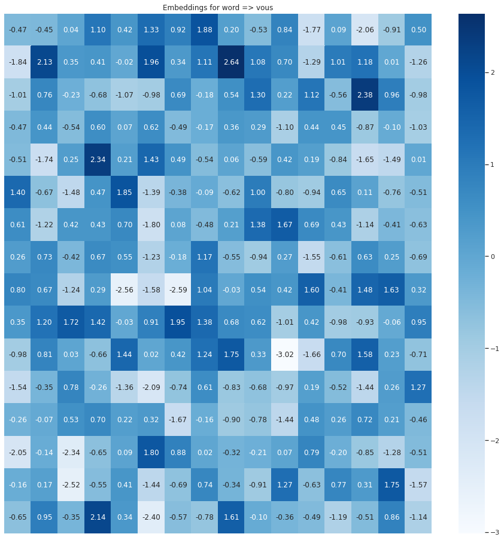<br>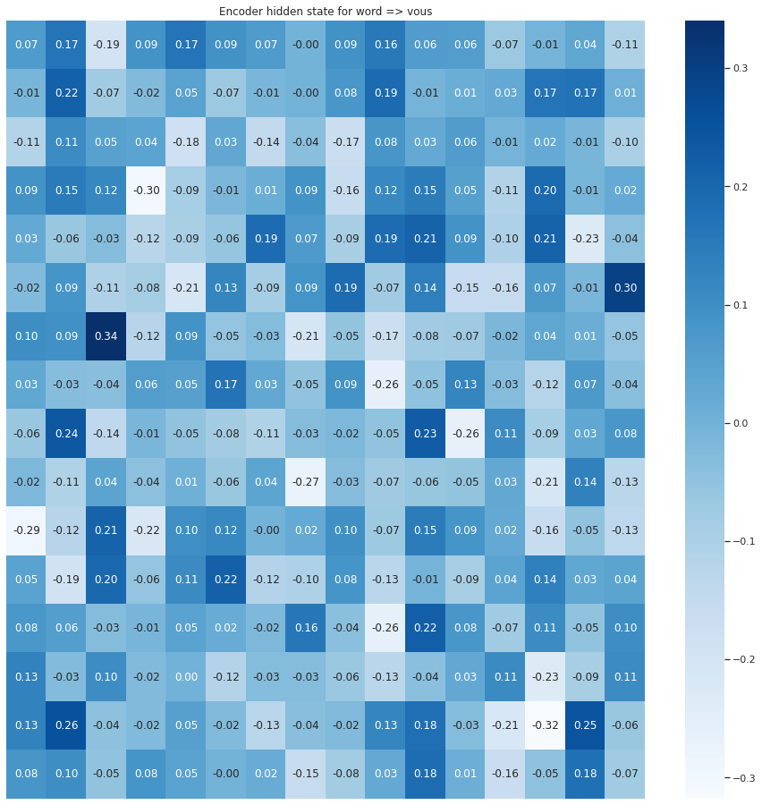 | Step 0 <br> Expected output(word) => you <br> Expected output(Index) => 129 <br> Decoder Embedding shape torch.Size([1, 1, 256]) <br> Predicted output(word) => absolute <br> Predicted output(Index) => 1467 <br> <br> |
|1| Step 1 <br> Word => me <br>  <br> torch.Size([1, 1, 256]) torch.Size([1, 1, 256]) torch.Size([1, 1, 256]) torch.Size([1, 1, 256]) <br> 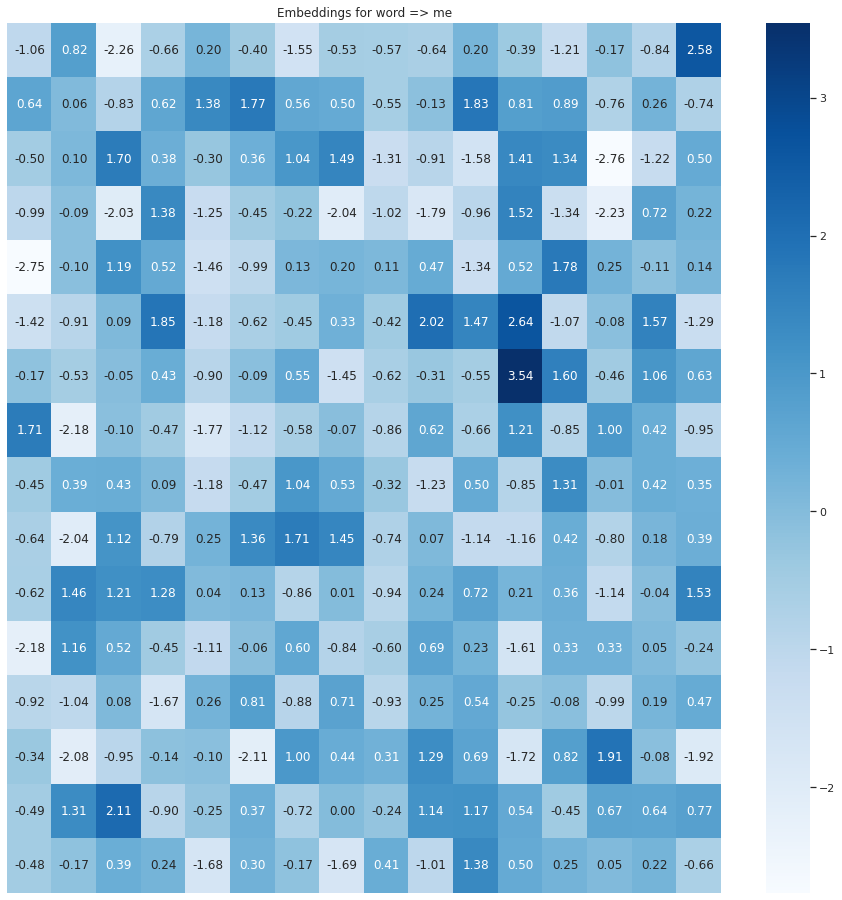<br>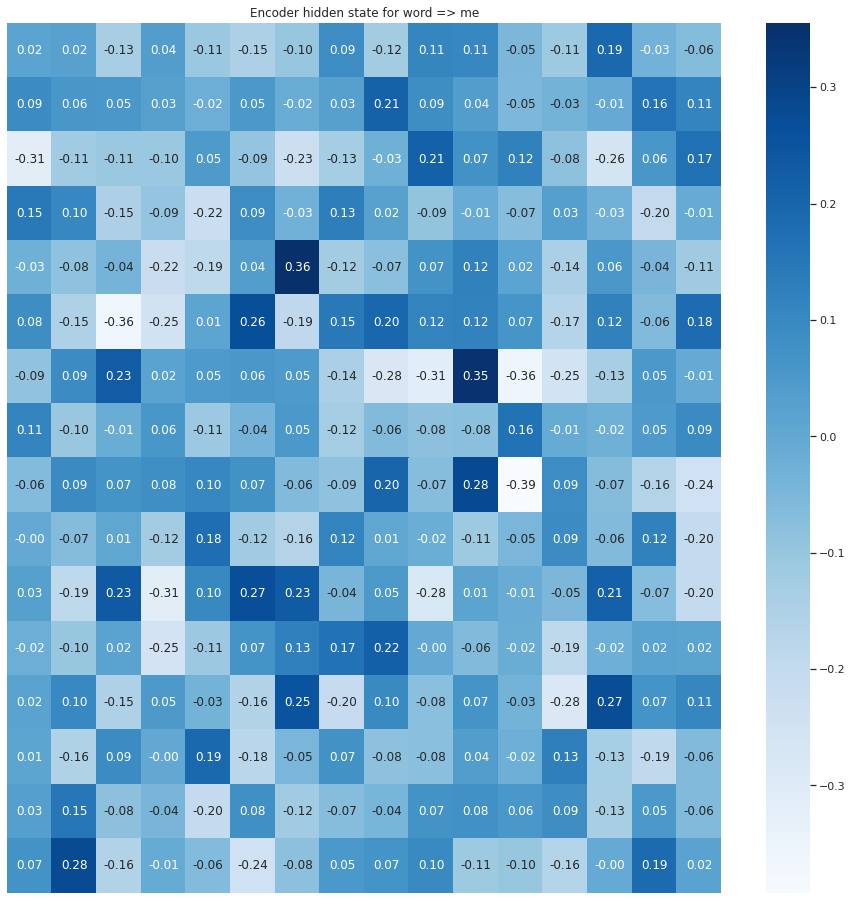 | Step 1 <br> Expected output(word) => re <br> Expected output(Index) => 78 <br> Predicted output(word) => concerns <br> Predicted output(Index) => 2549 <br> <br> |
|2| Step 2 <br> Word => faites <br>  <br> torch.Size([1, 1, 256]) torch.Size([1, 1, 256]) torch.Size([1, 1, 256]) torch.Size([1, 1, 256]) <br> 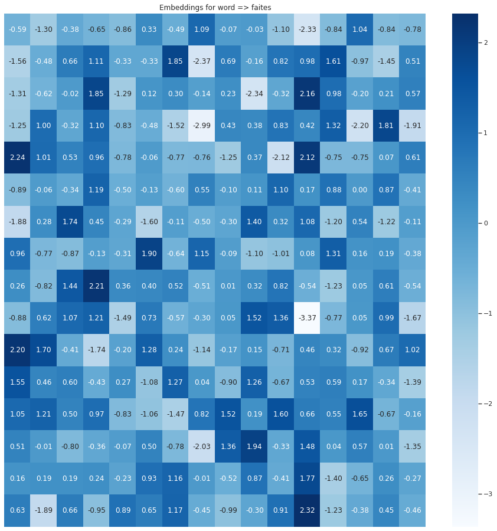<br>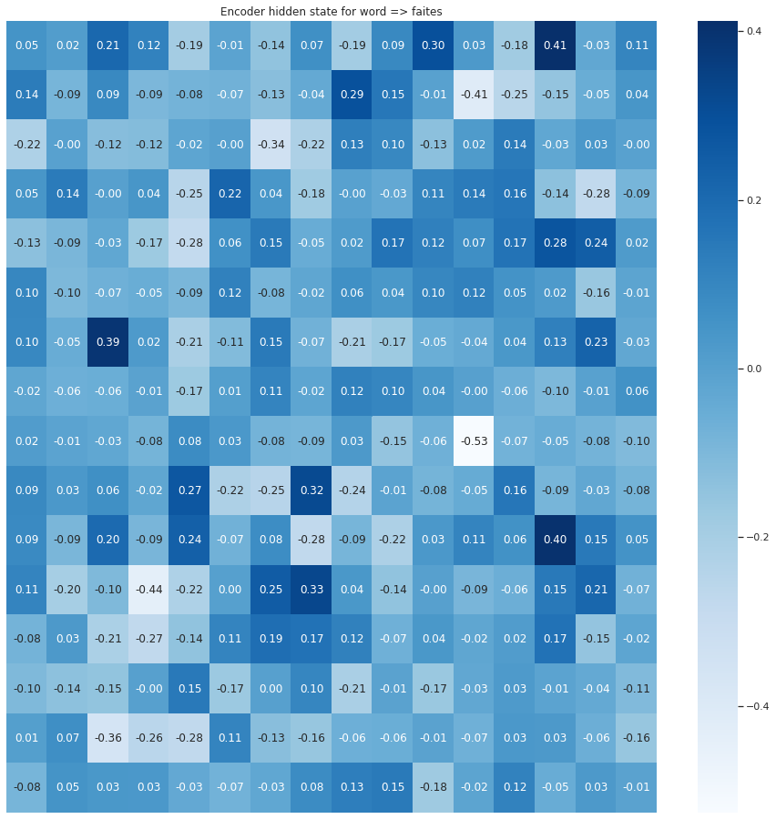 | Step 2 <br> Expected output(word) => making <br> Expected output(Index) => 505 <br> Predicted output(word) => mobile <br> Predicted output(Index) => 2642 <br> <br> |
|3| Step 3 <br> Word => rougir <br>  <br> torch.Size([1, 1, 256]) torch.Size([1, 1, 256]) torch.Size([1, 1, 256]) torch.Size([1, 1, 256]) <br> 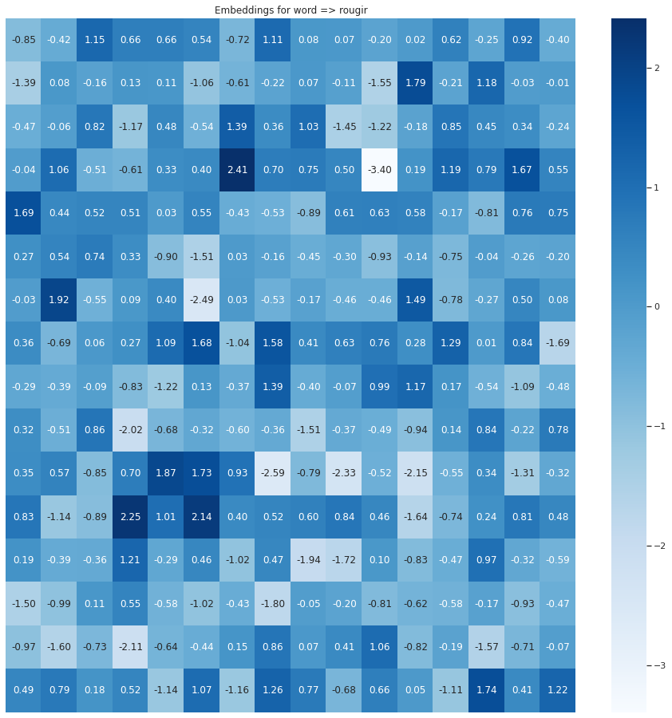<br>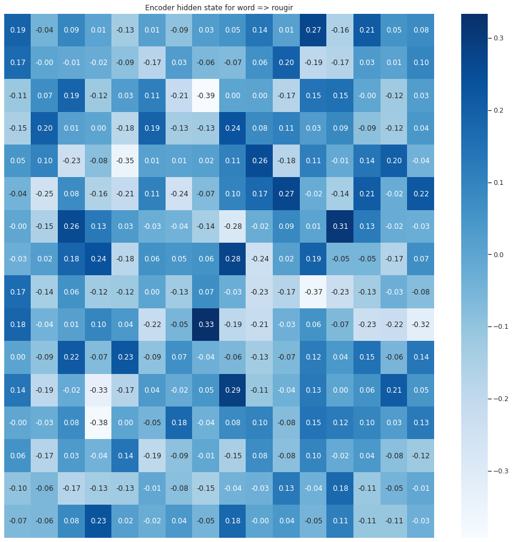 | Step 3 <br> Expected output(word) => me <br> Expected output(Index) => 343 <br> Predicted output(word) => volunteering <br> Predicted output(Index) => 800 <br> <br> |
|4| Step 4 <br> Word => . <br>  <br> torch.Size([1, 1, 256]) torch.Size([1, 1, 256]) torch.Size([1, 1, 256]) torch.Size([1, 1, 256]) <br> 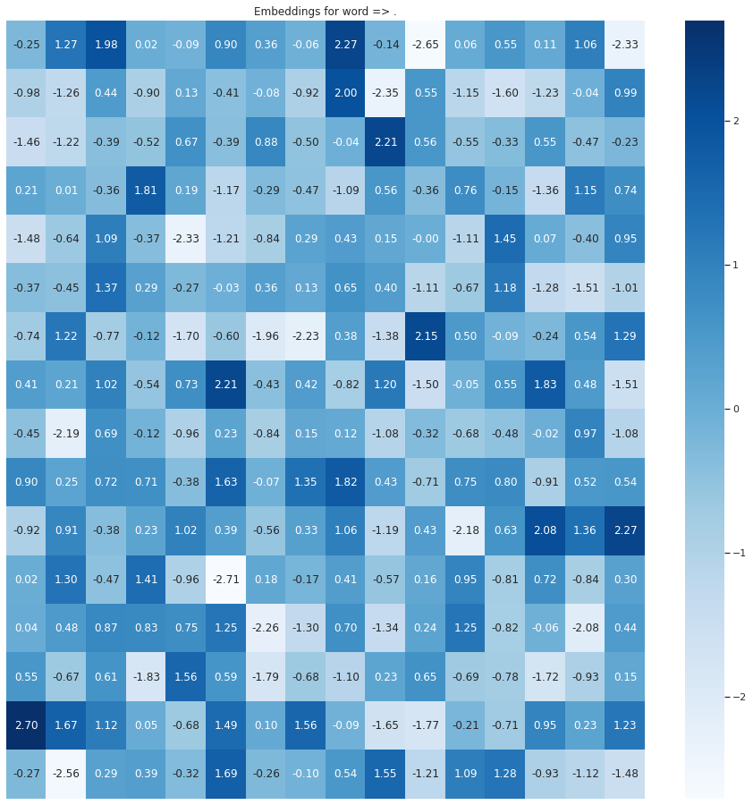<br>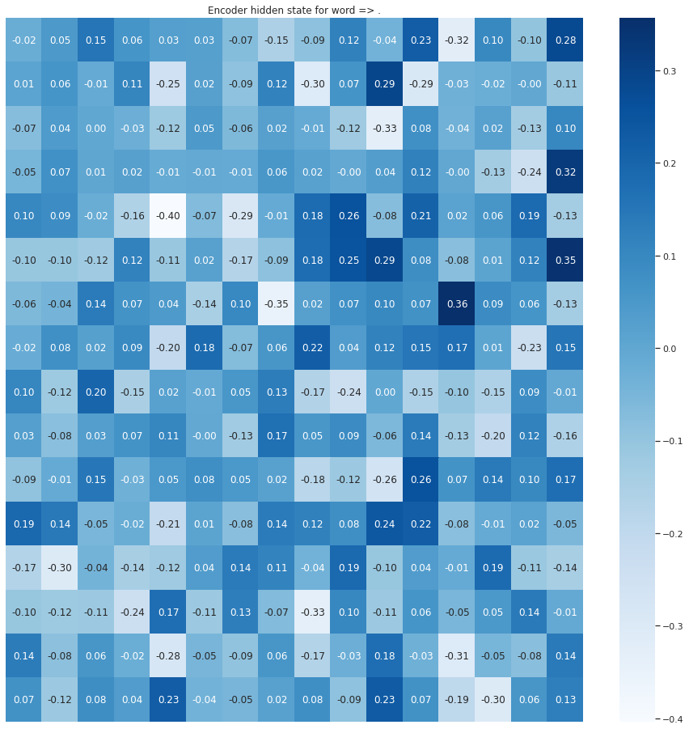 | Step 4 <br> Expected output(word) => blush <br> Expected output(Index) => 1655 <br> Predicted output(word) => volunteering <br> Predicted output(Index) => 800 <br> 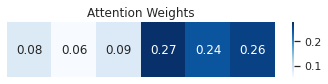<br> |
|5| Step 5 <br> Word => EOS Tag <br>  <br> torch.Size([1, 1, 256]) torch.Size([1, 1, 256]) torch.Size([1, 1, 256]) torch.Size([1, 1, 256]) <br> 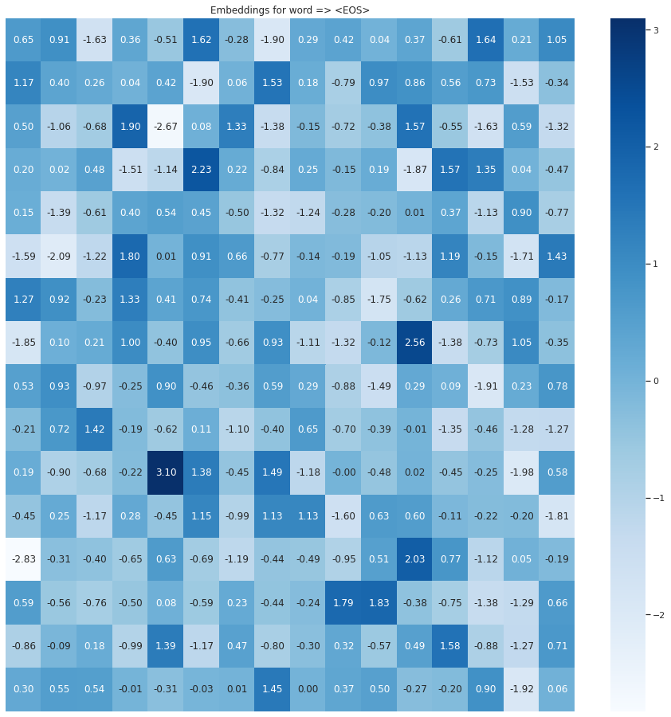<br>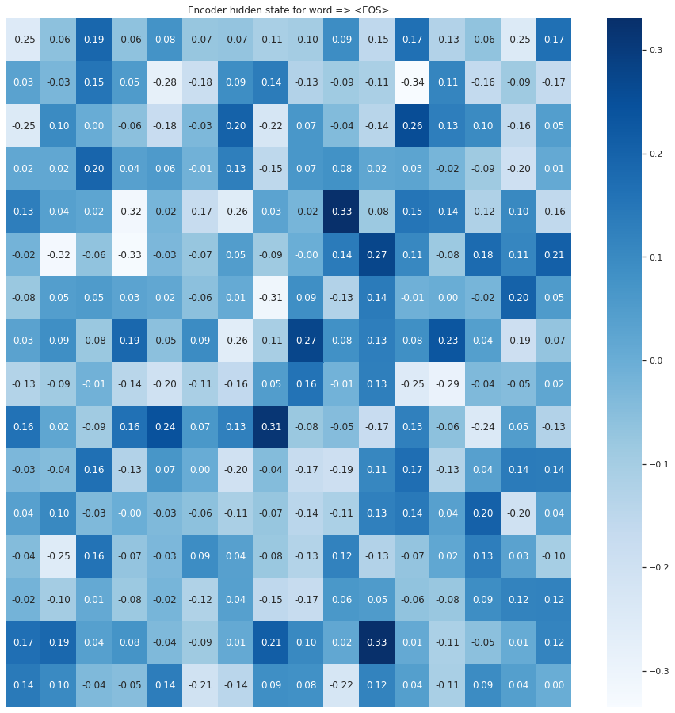 | Step 5 <br> Expected output(word) => . <br> Expected output(Index) => 4 <br> Predicted output(word) => situation <br> Predicted output(Index) => 2227 <br> <br> |
|6| - | Step 6 <br> Expected output(word) => EOS Tag <br> Expected output(Index) => 1 <br> Predicted output(word) => mobile <br> Predicted output(Index) => 2642 <br> <br> |

### LSTM 

| Steps| Encoder | Decoder |
|--|--|--|
|0| <br> | <br> |
|0| <br> | <br> |
|0| <br> | <br> |
|0| <br> | <br> |
|0| <br> | <br> |
|0| <br> | <br> |
|6| <br> | <br> |


## Refrences
 - [Attention Mechanism](https://blog.floydhub.com/attention-mechanism/)
 - [Attention Mechanism Code](https://github.com/spro/practical-pytorch/tree/master/seq2seq-translation)
    
