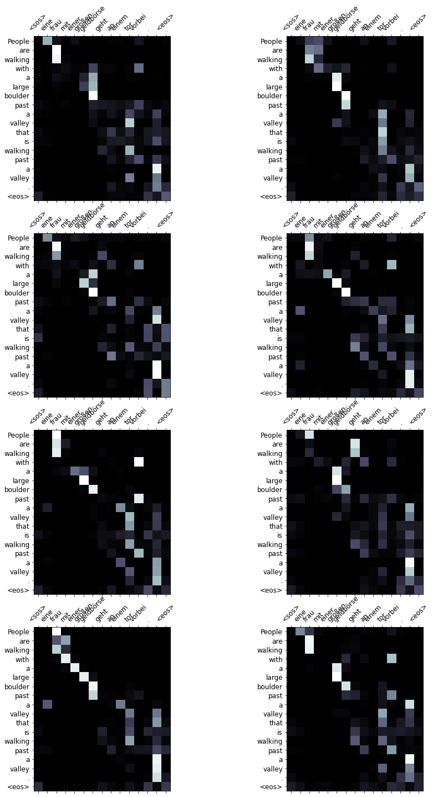
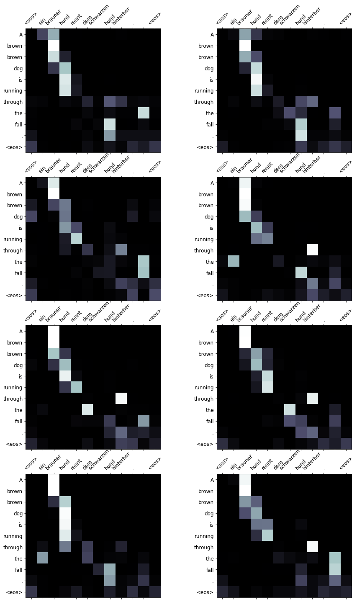
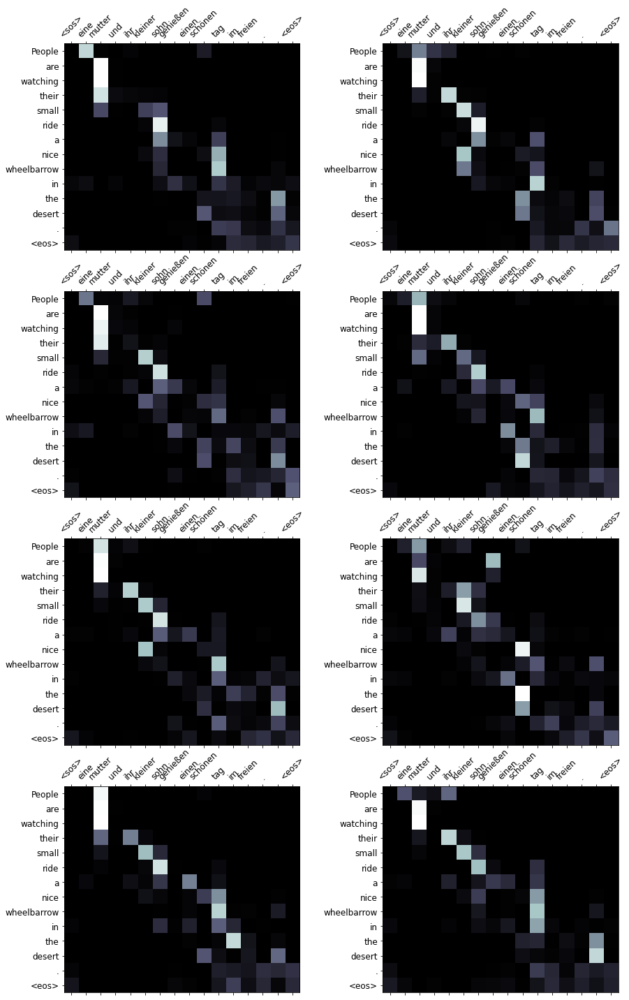

# Session 13 Attention is all you need (AIAYN)

## Objective
This  [code](https://colab.research.google.com/github/bentrevett/pytorch-seq2seq/blob/master/6%20-%20Attention%20is%20All%20You%20Need.ipynb#scrollTo=FqXbPB80r8p4)is from the same repo that we were following.

1.  remove all the legacy stuff from file.
2.  Training EPOCH logs
3.  Sample translation for 10 example


## Solution

[](https://githubtocolab.com/pankaj90382/END-1.0/blob/main/S13/Attention%20is%20All%20You%20Need_Torchtext.ipynb)

### Dataset - Multi30K

The data consists of a set of thousands of **French to English translation** pairs. Each word in both the the languages will be represented as a one-hot vector. This process is handled by the Lang class. The data is normalized wherein it is transformed to lowercase and converted from unicode to ASCII. All non-letter characters are also omitted as part of the normalization process. Normalization is done to define the data in a standard form so as to reduce randomness and increase efficiency. Once the normalization process is completed, we reduce the size of the available input data using two parameters- the length of the sentence (maximum of 10 words) and certain prefixes found in the English language. At the end of this process, we have a standardised limited dataset of English to French pairs.

### Results

```text
Epoch: 01 | Time: 0m 20s
	Train Loss: 4.469 | Train PPL:  87.251
	 Val. Loss: 3.292 |  Val. PPL:  26.895
Epoch: 02 | Time: 0m 20s
	Train Loss: 2.889 | Train PPL:  17.967
	 Val. Loss: 2.534 |  Val. PPL:  12.605
Epoch: 03 | Time: 0m 20s
	Train Loss: 2.249 | Train PPL:   9.480
	 Val. Loss: 2.217 |  Val. PPL:   9.176
Epoch: 04 | Time: 0m 21s
	Train Loss: 1.846 | Train PPL:   6.334
	 Val. Loss: 2.065 |  Val. PPL:   7.887
Epoch: 05 | Time: 0m 21s
	Train Loss: 1.560 | Train PPL:   4.761
	 Val. Loss: 1.994 |  Val. PPL:   7.341
Epoch: 06 | Time: 0m 21s
	Train Loss: 1.336 | Train PPL:   3.803
	 Val. Loss: 1.949 |  Val. PPL:   7.021
Epoch: 07 | Time: 0m 21s
	Train Loss: 1.154 | Train PPL:   3.170
	 Val. Loss: 1.963 |  Val. PPL:   7.121
Epoch: 08 | Time: 0m 21s
	Train Loss: 1.000 | Train PPL:   2.719
	 Val. Loss: 1.984 |  Val. PPL:   7.275
Epoch: 09 | Time: 0m 21s
	Train Loss: 0.868 | Train PPL:   2.382
	 Val. Loss: 2.008 |  Val. PPL:   7.452
Epoch: 10 | Time: 0m 21s
	Train Loss: 0.754 | Train PPL:   2.125
	 Val. Loss: 2.049 |  Val. PPL:   7.757
Epoch: 11 | Time: 0m 21s
	Train Loss: 0.662 | Train PPL:   1.938
	 Val. Loss: 2.103 |  Val. PPL:   8.189
Epoch: 12 | Time: 0m 21s
	Train Loss: 0.585 | Train PPL:   1.795
	 Val. Loss: 2.155 |  Val. PPL:   8.629
Epoch: 13 | Time: 0m 21s
	Train Loss: 0.522 | Train PPL:   1.685
	 Val. Loss: 2.216 |  Val. PPL:   9.167
Epoch: 14 | Time: 0m 21s
	Train Loss: 0.470 | Train PPL:   1.600
	 Val. Loss: 2.249 |  Val. PPL:   9.474
Epoch: 15 | Time: 0m 21s
	Train Loss: 0.428 | Train PPL:   1.534
	 Val. Loss: 2.311 |  Val. PPL:  10.080
Epoch: 16 | Time: 0m 21s
	Train Loss: 0.388 | Train PPL:   1.474
	 Val. Loss: 2.366 |  Val. PPL:  10.652
Epoch: 17 | Time: 0m 21s
	Train Loss: 0.360 | Train PPL:   1.434
	 Val. Loss: 2.412 |  Val. PPL:  11.160
Epoch: 18 | Time: 0m 21s
	Train Loss: 0.334 | Train PPL:   1.396
	 Val. Loss: 2.471 |  Val. PPL:  11.838
```

### Examples

```text
src = Ein kleiner Junge in Baseballmontur holt mit einem Schläger hinter seinem Kopf in Richtung eines vor ihm montierten Baseballs aus.

pred = Young young boy in a karate match with a wheelbarrow out of a rock in front of a wheelbarrow of him in front of a wheelbarrow . <eos>
trg = A small boy wearing baseball regalia holds a bat behind his head with a baseball mounted in front of him.


src = Zwei Kinder sitzen nebeneinander und essen Süßigkeiten.

pred = 2 child are sitting next to two eating food . <eos>
trg = Two children sit side by side while eating a treat.


src = Eine afrikanische Familie steht vor ein paar provisorischen Behausungen.

pred = African American people are standing in front of a few trees . <eos>
trg = An african family are standing in front of some makeshift houses.


src = Zwei braune Hunde rennen durch den Schnee.

pred = Two brown dogs are running through the mud . <eos>
trg = Two brown dogs are running through the snow.


src = Ein Junge in einem roten Trikot versucht, die Home Base zu erreichen, während der Catcher im blauen Trikot versucht, ihn zu fangen.

pred = Young in a red kayak is attempting to make a rope race with blue buoy in the fall to make him . <eos>
trg = A boy in a red uniform is attempting to avoid getting out at home plate, while the catcher in the blue uniform is attempting to catch him.


src = Ein Mädchen springt von Fels zu Fels über den Bach.

pred = A climber is jumping off a barrel to see a wheelbarrow of seaweed . <eos>
trg = A girl hops across the river, from rock to rock.


src = Ein Mann ohne Hemd geht zu einem gelben Kajak.

pred = A group of people are walking with a yellow wheelbarrow to see a yellow valley . <eos>
trg = A shirtless man walks toward a yellow kayak.


src = Die Silhouette eines Mannes und einer Frau, die ein großes Feuer oder einen anderen großen, brennenden Holzgegenstand betrachten.

pred = People are seen in a wheelbarrow , including a large amount of people , watching him or seen out in the fall or out or seen from a large fire pit . <eos>
trg = There is an outline of a male and female observing a bonfire or other large burning wooden object.


src = Eine Frau in einem blauen Shirt und weißen Shorts spielt Tennis.

pred = People in a blue race , with white buoy , playing a leaf closed . <eos>
trg = A woman in a blue shirt and white shorts playing tennis.


src = Zwei junge Mädchen sitzen auf der Straße und essen Mais.

pred = 2 young adults are sitting on the ground eating food . <eos>
trg = Two young girls are sitting on the street eating corn.
```

### Attention Visualization

A Sample from Training Set

```python
src = 'Eine Frau mit einer großen Geldbörse geht an einem Tor vorbei.'
trg = 'A woman with a large purse is walking by a gate.'

predicted trg = ['People', 'are', 'walking', 'with', 'a', 'large', 'boulder', 'past', 'a', 'valley', 'that', 'is', 'walking', 'past', 'a', 'valley', '.', '<eos>']
```



---
A Sample from Validation Test

```python
src = 'Ein brauner Hund rennt dem schwarzen Hund hinterher.'
trg = 'A brown dog is running after the black dog.'

predicted trg = ['A', 'brown', 'brown', 'dog', 'is', 'running', 'through', 'the', 'fall', '.', '<eos>']
```



---

A Sample from Test Set

```python
src = 'Eine Mutter und ihr kleiner Sohn genießen einen schönen Tag im Freien.'
trg = 'A mother and her young song enjoying a beautiful day outside.'

predicted trg = ['People', 'are', 'watching', 'their', 'small', 'ride', 'a', 'nice', 'wheelbarrow', 'in', 'the', 'desert', '.', '<eos>']
```




---
