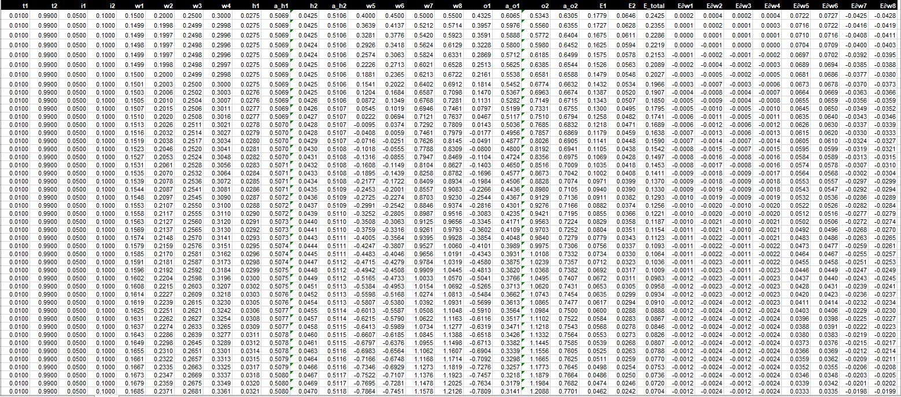

# Session 2 - Neural Network Design (BackProp)

## Objective:

Create excel sheet showing backpropagation. Explain each major step with following guidelines. 
- Use exactly the same values for all variables as used in the class
- Take a screenshot, and show that screenshot in the readme file
- Excel file must be there for us to cross-check the image shown on readme (no image = no score)
- Explain each major step
- Show what happens to the error graph when you change the learning rate from [0.1, 0.2, 0.5, 0.8, 1.0, 2.0]

## Solution

### Loss vs Iteration Graph with respect to Learning Rate

The graph shows how the learning rate changes the whole game in neural network. 
1.  When the **learning rate is 0.1** the overall loss decreases slowly compared to other learning rates. It needs high number of epochs to reach the accuracy. 
2.  As **learning rate varies from 0.1 to 1.0**, the overall loss of the neural network dimnishes very rapidly on every epoch. The learning rate below 0.5 creates a decreasing linear graph, howerver, on other side it creates decreasing exponential graph.
3.  In the case the **learning rate from 1.0 to 2.0**, after 10th to 15th epoch, the overall loss reaches to point where it cannot be dimnishes further and creating a constantgraph.

### Learning Rate with 0.5 values

That's interesting to look how the total loss values rapidly dimnishes with constant learning rate. Every line considered as one epoch and all the weights are trained according to the backpropagation with aspect to learning rate (Explainrd Later in Mathematics).

### Steps Explnation (Mostly Math Derivative Part)

To train above neural network model, there are two most basic things which are loss and learning rate. To decrease the loss, one popular method used is gradient descent because it creates concave loss function graph, it's best possible to chance to avoid local minima. The gradient loss function can be defined by

$$W_{new}=W_{old}-\eta\nabla{E_{total}}$$

where

$$W_{new} = \text{new weights} \\ W_{old}= \text{old weights} \\ \eta = \text{learning rate} \\ E_{total} = \text{error total}$$

Now we have weights $$W = \lbrack w_1, w_2, w_3, w_4, w_5, w_6, w_7, w_8 \rbrack$$

and

$$\nabla E_{total} = \nabla E_t = \lbrack \frac{\partial E_t}{\partial w_1}, \frac{\partial E_t}{\partial w_2}, \frac{\partial E_t}{\partial w_3}, \frac{\partial E_t}{\partial w_4}, \frac{\partial E_t}{\partial w_5}, \frac{\partial E_t}{\partial w_6}, \frac{\partial E_t}{\partial w_7}, \frac{\partial E_t}{\partial w_8} \rbrack$$

Now see carefully, the below equations, along with our network diagram above somewhere, very important!

$$h_1=w_1 i_i+w2 i_2 \\ h_2=w_3i_1+w4i_2 $$

$$
a_{h1} = \sigma({h_1}) \\  a_{h2} = \sigma({h_2})
$$

$$
o_1 = w_5a_{h_1}+w_6a_{h_2} \\ o_2 = w_7a_{h_1}+w_8a_{h_2}
$$

$$
a_{o_1} = \sigma(o_1) \\ a_{o_2} = \sigma(o_2)
$$

$$
E_1=\frac{1}{2}(t_1-a_{o_1})^2 \\ .\\ E_2=\frac{1}{2}(t_2-a_{o_1})^2
$$

Where $$[i_1, i_2] \text{ and }[t_1, t_2]$$ are the inputs and target outputs respectively

Now we can start to compute the partial derivatives w.r.t to the weights, and also remember to use chain rule wherever applicable and necessary.

$$\frac{\partial E_t}{\partial w_5} = \frac{\partial E_1}{\partial w_5} = \frac{\partial E_1}{\partial a_{o_1}} \frac{\partial a_{o_1}}{\partial o_1} \frac{\partial o_1}{\partial w_5}$$

We didn't consider E2 above, because it does no contribution to w5

$$\frac{\partial E_1}{\partial a_{o_1}}  = \frac{\partial \frac{1}{2}(t_1-a_{o_1})^2}{\partial a_{o_1}}  = a_{o_1}-t_1$$

$$\frac{\partial a_{o_1}}{\partial o_1}=\frac{\partial \sigma{(o_1)} }{\partial o_1} = \sigma(o_1)(1-\sigma(o_1)) = (a_{o_1})(1-a_{o_1})$$

and
$$\frac{\partial o_1}{\partial w_5} = a-o_1$$

similarly we can complete it for other weights in the last hidden layer

$$\frac{\partial E_t}{\partial w_5} = (a_{o_1}-t_1)(a_{o_1})(1-a_{o_1})a_{h_{1}}$$
$$\frac{\partial E_t}{\partial w_6} = (a_{o_1}-t_1)(a_{o_1})(1-a_{o_1})a_{h_{2}}$$
$$\frac{\partial E_t}{\partial w_7} = (a_{o_2}-t_2)(a_{o_2})(1-a_{o_2})a_{h_{1}}$$
$$\frac{\partial E_t}{\partial w_8} = (a_{o_2}-t_2)(a_{o_2})(1-a_{o_2})a_{h_{2}}$$

Now coming to the first hidden layer weights

$$\frac{\partial E_t}{\partial w_1}  = \frac{\partial E_t}{\partial a_{o_1}} \frac{\partial a_{o_1}}{\partial o_1 } \frac{\partial o_1}{\partial a_{h_1}} \frac{\partial a_{h_1}}{\partial h_1} \frac{\partial{h_1}}{\partial{w_1}}$$

Seen this somewhere, right, we did this before

$$\frac{\partial E_t}{\partial a_{o_1}} \frac{\partial a_{o_1}}{\partial o_1 } \frac{\partial o_1}{\partial a_{h_1}} = \frac{\partial (E_1+E_2)}{\partial a_{h_1}}= \frac{\partial E_1}{\partial a_{h_1}}  \frac{\partial E_2}{\partial a_{h_1}} \\ . \\ = (a_{o_1}-t_1)(a_{o_1})(1-a_{o_1})w_5 \\ + (a_{o_2}-t_2)(a_{o_2})(1-a_{o_2})w_7$$

Now we can compute all the gradient of the first layer

$$\frac{\partial E_t}{\partial w_1} = \frac{\partial E_t}{\partial a_{h_1}} (a-h_1)(1-a_{h_1})i_1$$
$$\frac{\partial E_t}{\partial w_2} = \frac{\partial E_t}{\partial a_{h_1}} (a-h_1)(1-a_{h_1})i_2$$
$$\frac{\partial E_t}{\partial w_3} = \frac{\partial E_t}{\partial a_{h_2}} (a-h_2)(1-a_{h_2})i_1$$
$$\frac{\partial E_t}{\partial w_4} = \frac{\partial E_t}{\partial a_{h_2}} (a-h_2)(1-a_{h_2})i_2$$
