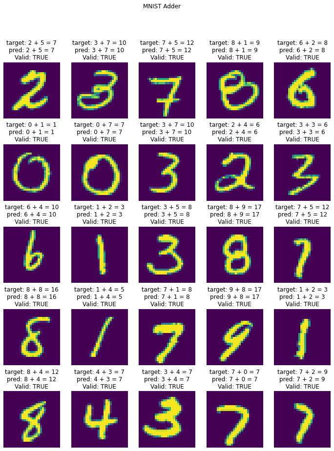

# Session 3 - MNIST ADDER NETWEOK DESIGN

## Objective
1.  Write a neural network that can:
    1.  take 2 inputs:
        1.  an image from MNIST dataset, and
        2.  a random number between 0 and 9
    2.  and gives two outputs:
        1.  the "number" that was represented by the MNIST image, and
        2.  the "sum" of this number with the random number that was generated and sent as the input to the network
    3.  you can mix fully connected layers and convolution layers
    4.  you can use one-hot encoding to represent the random number input as well as the "summed" output.
2.  Your code MUST be:
    1.  well documented (via readme file on github and comments in the code)
    2.  must mention the data representation
    3.  must mention your data generation strategy
    4.  must mention how you have combined the two inputs
    5.  must mention how you are evaluating your results
    6.  must mention "what" results you finally got and how did you evaluate your results
    7.  must mention what loss function you picked and why!
    8.  training MUST happen on the GPU

## Solution

[](https://colab.research.google.com/github/pankaj90382/END-1.0/blob/main/S3/MNIST_ADDER.ipynb)

### Data Representation

The Data sample is always represented as `(input, target)` where both the input and target have to be `torch.Tensor`, conversion to Tensor is taken care by PyTorch's `DataLoader` for primitive types, for MNIST Image we need to use the torchvision transforms' `ToTensor` method.

My Representation for `(img, target` is `(img, random_number),  (target, target + random_number)`

### Data Generation Strategy

```python
class MyDataset(MNIST):

    def __init__(self, *args, **kwargs):
        super(MyDataset, self).__init__(*args, **kwargs)
        
    def __getitem__(self, index):
        img, target = super(self.__class__, self).__getitem__(index)
        random_number = np.random.randint(low=0, high=10)
        return (img, random_number), (target, target + random_number)
```
### The Network

The model's primary task is to figure out the MNIST Image Classification, for that take from my [TSAI Session 4 of EVA Phase 1](https://github.com/pankaj90382/TSAI/tree/master/S4)  MNIST Classification Model and only use the last layer before the softmax.

Now, i got 10 Channels as a flattened layer, and concatenated with the one-hot representation of the "random" number, so 20 features in total, Now from here on i use Linear Layers which will do the addition, and out of 19 features of my Addition classification.

Why 19 features ? because 0-9 (MNIST) + 0-9 (Random) will be 0-18 numbers, or 19 possible numbers in total.

```python
class Net(nn.Module):
    def __init__(self, num_classes):
        super(Net, self).__init__()
        self.num_classes = num_classes
        self.conv1 = nn.Conv2d(1, 8, 3, padding=1) #input -? OUtput? RF
        self.conv2 = nn.Sequential(nn.Conv2d(8, 8, 3, padding=1),nn.BatchNorm2d(8))
        self.pool1 = nn.MaxPool2d(2, 2)
        self.conv3 = nn.Conv2d(8, 8, 3, padding=1)
        self.conv4 = nn.Sequential(nn.Conv2d(8, 16, 3, padding=1),nn.BatchNorm2d(16),nn.Dropout(0.23))
        self.pool2 = nn.MaxPool2d(2, 2)
        self.conv5 = nn.Conv2d(16, 32, 3)
        self.conv6 = nn.Conv2d(32, 32, 3)
        self.conv7 = nn.Conv2d(32, 10, 3)
        self.adder_layer1 = nn.Sequential(nn.Linear(in_features=20, out_features=60, bias=False),nn.BatchNorm1d(60),nn.ReLU(),nn.Dropout(0.1))
        self.adder_layer2 = nn.Sequential(nn.Linear(in_features=60, out_features=60, bias=False),nn.BatchNorm1d(60),nn.ReLU(),nn.Dropout(0.1))
        self.adder_layer3 = nn.Sequential(nn.Linear(in_features=60, out_features=19, bias=False))


    def forward(self, x, y):
        y = F.one_hot(y, num_classes=self.num_classes)
        x = self.pool1(F.relu(self.conv2(F.relu(self.conv1(x)))))
        x = self.pool2(F.relu(self.conv4(F.relu(self.conv3(x)))))
        x = F.relu(self.conv6(F.relu(self.conv5(x))))
        x = self.conv7(x)
        x = x.view(-1, 10)
        y = torch.cat([x, y], dim=-1)
        y = self.adder_layer1(y)
        y = self.adder_layer2(y)
        y = self.adder_layer3(y)
        return F.log_softmax(x), F.log_softmax(y)
```

### Loss Functions

The first task is to classify the mnist image, so choice of loss function for that is negative log likelihood loss` (negative log likelihood).

But for the adder, since i used a one hot representation for the output, negative log likelihood loss seems like a good choice for it too. So i went with that.

Now both these losses are combined by simple addition. We can also give more weightage to the MNIST Loss, because without the correct prediction for MNIST we cannot give the correct output for the adder.

```python
        
        ......
        both mnist and adder_loss use negative log likelihood loss
        mnist_pred, final_pred = model(mnist_x, rand_num)
        mnist_loss = F.nll_loss(mnist_pred, mnist_y)
        adder_loss = F.nll_loss(final_pred, final_y)
```

### Results Evaluation

The Output obtained from the model is evaluated against the target.

```python

            .......
            mnist_pred = torch.argmax(mnist_pred, dim=1)
            final_pred = torch.argmax(final_pred, dim=1)
            mnist_correct += mnist_pred.eq(mnist_y.view_as(mnist_pred)).sum().item()
            adder_correct += final_pred.eq(final_y.view_as(final_pred)).sum().item()
```

Accuracy of MNIST After 20 Epochs:- `99.33`
Accuracy of ADDER After 20 Epochs:- `99.21`


### Sample Test Outputs

| Results 1 | Results 2 |
|-----------|-----------|
|    |   |


## Training Logs

The Model was trained for `20` epochs with Optimizer `SGD: Stochastic Gradient Descent`.

```
  0%|          | 0/469 [00:00<?, ?it/s]/usr/local/lib/python3.7/dist-packages/ipykernel_launcher.py:30: UserWarning: Implicit dimension choice for log_softmax has been deprecated. Change the call to include dim=X as an argument.
loss=1.1576958894729614, MNIST_LOSS=0.1674126833677292, ADDER_LOSS=0.990283191204071, batch_id=468: 100%|██████████| 469/469 [00:23<00:00, 20.19it/s]
  0%|          | 0/469 [00:00<?, ?it/s]
Test set: Average loss: 0.0085, MNIST_Accuracy: 9559/10000 (95.59%), ADDER_Accuracy: 9019/10000 (90.19%)

loss=0.4287705719470978, MNIST_LOSS=0.112477146089077, ADDER_LOSS=0.3162934184074402, batch_id=468: 100%|██████████| 469/469 [00:23<00:00, 20.16it/s]
  0%|          | 0/469 [00:00<?, ?it/s]
Test set: Average loss: 0.0016, MNIST_Accuracy: 9863/10000 (98.63%), ADDER_Accuracy: 9831/10000 (98.31%)

loss=0.32282382249832153, MNIST_LOSS=0.102923683822155, ADDER_LOSS=0.21990014612674713, batch_id=468: 100%|██████████| 469/469 [00:23<00:00, 19.97it/s]
  0%|          | 0/469 [00:00<?, ?it/s]
Test set: Average loss: 0.0011, MNIST_Accuracy: 9896/10000 (98.96%), ADDER_Accuracy: 9872/10000 (98.72%)

loss=0.1353697031736374, MNIST_LOSS=0.03294793888926506, ADDER_LOSS=0.10242176055908203, batch_id=468: 100%|██████████| 469/469 [00:23<00:00, 20.18it/s]
  0%|          | 0/469 [00:00<?, ?it/s]
Test set: Average loss: 0.0009, MNIST_Accuracy: 9920/10000 (99.20%), ADDER_Accuracy: 9891/10000 (98.91%)

loss=0.07337716221809387, MNIST_LOSS=0.0168799739331007, ADDER_LOSS=0.05649719014763832, batch_id=468: 100%|██████████| 469/469 [00:23<00:00, 20.27it/s]
  0%|          | 0/469 [00:00<?, ?it/s]
Test set: Average loss: 0.0010, MNIST_Accuracy: 9853/10000 (98.53%), ADDER_Accuracy: 9842/10000 (98.42%)

loss=0.07298686355352402, MNIST_LOSS=0.025381339713931084, ADDER_LOSS=0.04760552570223808, batch_id=468: 100%|██████████| 469/469 [00:23<00:00, 20.00it/s]
  0%|          | 0/469 [00:00<?, ?it/s]
Test set: Average loss: 0.0006, MNIST_Accuracy: 9930/10000 (99.30%), ADDER_Accuracy: 9904/10000 (99.04%)

loss=0.030107539147138596, MNIST_LOSS=0.010075696744024754, ADDER_LOSS=0.020031841471791267, batch_id=468: 100%|██████████| 469/469 [00:23<00:00, 19.94it/s]
  0%|          | 0/469 [00:00<?, ?it/s]
Test set: Average loss: 0.0007, MNIST_Accuracy: 9919/10000 (99.19%), ADDER_Accuracy: 9895/10000 (98.95%)

loss=0.14066626131534576, MNIST_LOSS=0.030183425173163414, ADDER_LOSS=0.1104828417301178, batch_id=468: 100%|██████████| 469/469 [00:23<00:00, 20.03it/s]
  0%|          | 0/469 [00:00<?, ?it/s]
Test set: Average loss: 0.0006, MNIST_Accuracy: 9935/10000 (99.35%), ADDER_Accuracy: 9903/10000 (99.03%)

loss=0.11490893363952637, MNIST_LOSS=0.01450982317328453, ADDER_LOSS=0.10039911419153214, batch_id=468: 100%|██████████| 469/469 [00:23<00:00, 19.56it/s]
  0%|          | 0/469 [00:00<?, ?it/s]
Test set: Average loss: 0.0006, MNIST_Accuracy: 9917/10000 (99.17%), ADDER_Accuracy: 9897/10000 (98.97%)

loss=0.11564531922340393, MNIST_LOSS=0.025908373296260834, ADDER_LOSS=0.0897369459271431, batch_id=468: 100%|██████████| 469/469 [00:23<00:00, 19.93it/s]
  0%|          | 0/469 [00:00<?, ?it/s]
Test set: Average loss: 0.0006, MNIST_Accuracy: 9922/10000 (99.22%), ADDER_Accuracy: 9906/10000 (99.06%)

loss=0.09489831328392029, MNIST_LOSS=0.04964553192257881, ADDER_LOSS=0.045252781361341476, batch_id=468: 100%|██████████| 469/469 [00:23<00:00, 20.20it/s]
  0%|          | 0/469 [00:00<?, ?it/s]
Test set: Average loss: 0.0006, MNIST_Accuracy: 9921/10000 (99.21%), ADDER_Accuracy: 9904/10000 (99.04%)

loss=0.12428296357393265, MNIST_LOSS=0.024270862340927124, ADDER_LOSS=0.10001210123300552, batch_id=468: 100%|██████████| 469/469 [00:23<00:00, 19.77it/s]
  0%|          | 0/469 [00:00<?, ?it/s]
Test set: Average loss: 0.0005, MNIST_Accuracy: 9933/10000 (99.33%), ADDER_Accuracy: 9924/10000 (99.24%)

loss=0.1224784329533577, MNIST_LOSS=0.04778026044368744, ADDER_LOSS=0.07469817250967026, batch_id=468: 100%|██████████| 469/469 [00:23<00:00, 19.93it/s]
  0%|          | 0/469 [00:00<?, ?it/s]
Test set: Average loss: 0.0004, MNIST_Accuracy: 9934/10000 (99.34%), ADDER_Accuracy: 9916/10000 (99.16%)

loss=0.05940427631139755, MNIST_LOSS=0.028431549668312073, ADDER_LOSS=0.03097272664308548, batch_id=468: 100%|██████████| 469/469 [00:23<00:00, 19.97it/s]
  0%|          | 0/469 [00:00<?, ?it/s]
Test set: Average loss: 0.0005, MNIST_Accuracy: 9941/10000 (99.41%), ADDER_Accuracy: 9925/10000 (99.25%)

loss=0.03830946236848831, MNIST_LOSS=0.007708704099059105, ADDER_LOSS=0.030600758269429207, batch_id=468: 100%|██████████| 469/469 [00:23<00:00, 20.04it/s]
  0%|          | 0/469 [00:00<?, ?it/s]
Test set: Average loss: 0.0004, MNIST_Accuracy: 9936/10000 (99.36%), ADDER_Accuracy: 9932/10000 (99.32%)

loss=0.010783478617668152, MNIST_LOSS=0.004328254610300064, ADDER_LOSS=0.0064552235417068005, batch_id=468: 100%|██████████| 469/469 [00:23<00:00, 19.90it/s]
  0%|          | 0/469 [00:00<?, ?it/s]
Test set: Average loss: 0.0004, MNIST_Accuracy: 9940/10000 (99.40%), ADDER_Accuracy: 9932/10000 (99.32%)

loss=0.01817721128463745, MNIST_LOSS=0.004376142751425505, ADDER_LOSS=0.013801068998873234, batch_id=468: 100%|██████████| 469/469 [00:23<00:00, 20.04it/s]
  0%|          | 0/469 [00:00<?, ?it/s]
Test set: Average loss: 0.0005, MNIST_Accuracy: 9940/10000 (99.40%), ADDER_Accuracy: 9933/10000 (99.33%)

loss=0.02124529704451561, MNIST_LOSS=0.004314279183745384, ADDER_LOSS=0.016931017860770226, batch_id=468: 100%|██████████| 469/469 [00:23<00:00, 20.05it/s]
  0%|          | 0/469 [00:00<?, ?it/s]
Test set: Average loss: 0.0005, MNIST_Accuracy: 9938/10000 (99.38%), ADDER_Accuracy: 9931/10000 (99.31%)

loss=0.04506538808345795, MNIST_LOSS=0.01459500566124916, ADDER_LOSS=0.030470384284853935, batch_id=468: 100%|██████████| 469/469 [00:23<00:00, 19.87it/s]

Test set: Average loss: 0.0005, MNIST_Accuracy: 9933/10000 (99.33%), ADDER_Accuracy: 9921/10000 (99.21%)
```
