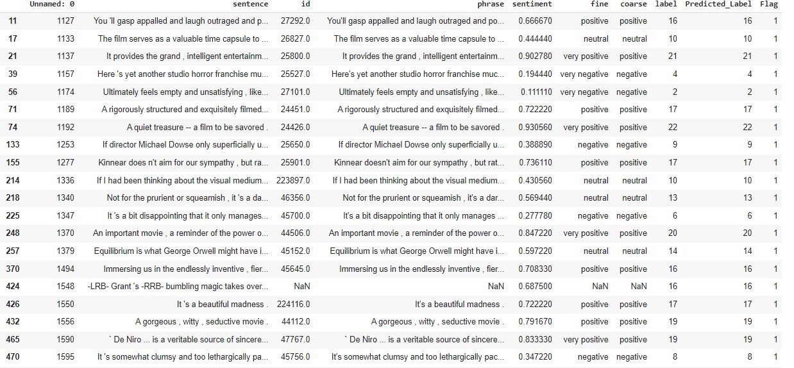
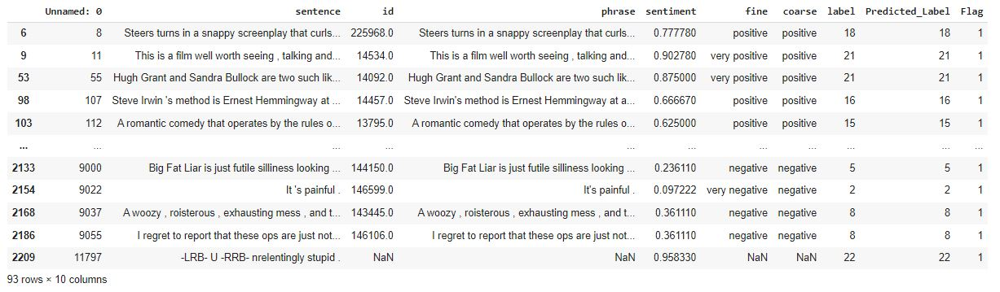
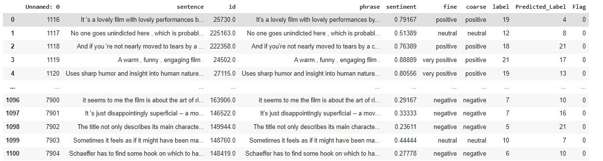
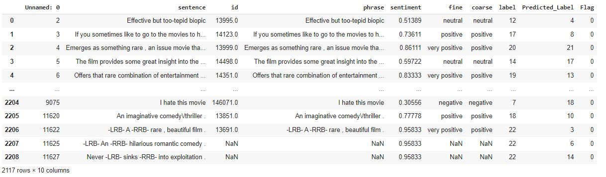

# Session 5 - Stanford Sentimental Data (STT)

## Objective

1.  Look at  [this code (Links to an external site.)](https://colab.research.google.com/drive/19wZi7P0Tzq9ZxeMz5EDmzfWFBLFWe6kN?usp=sharing&pli=1&authuser=3)  above. It has additional details on "Back Translate", i.e. using Google translate to convert the sentences. It has "random_swap" function, as well as "random_delete".
2.  Use "Back Translate", "random_swap" and "random_delete" to augment the data you are training on
3.  Download the StanfordSentimentAnalysis Dataset from this  [link (Links to an external site.)](http://nlp.stanford.edu/~socherr/stanfordSentimentTreebank.zip)(it might be troubling to download it, so force download on chrome). Use "datasetSentences.txt" and "sentiment_labels.txt" files from the zip you just downloaded as your dataset. This dataset contains just over 10,000 pieces of Stanford data from HTML files of Rotten Tomatoes. The sentiments are rated between 1 and 25, where one is the most negative and 25 is the most positive.
4.  Train your model and achieve  **60%+ validation/test accuracy**. Upload your collab file on GitHub with readme that contains details about your assignment/word (minimum  **250 words**),  **training logs showing final validation accuracy, and outcomes for  10  example inputs from the test/validation data.**


## Solution

| Model | Model with Augmentation |
|--|--|
| [Github](https://github.com/pankaj90382/END-1.0/blob/main/S5/Stanford_Data_LSTM.ipynb) [](https://githubtocolab.com/pankaj90382/END-1.0/blob/main/S5/Stanford_Data_LSTM.ipynb)| [Github](https://github.com/pankaj90382/END-1.0/blob/main/S5/Stanford_Data_LSTM_Augmented.ipynb) [](https://githubtocolab.com/pankaj90382/END-1.0/blob/main/S5/Stanford_Data_LSTM_Augmented.ipynb)|
|[Dataset](./Dataset)|[Augmented Dataset](./Dataset_Augmented)|

To use an LSTM instead of the standard RNN, I use nn.LSTM instead of nn.RNN. Also, note that the LSTM returns the output and a tuple of the final hidden state and the final cell state, whereas the standard RNN only returned the output and final hidden state.

As we are passing the lengths of our sentences to be able to use packed padded sequences, we have to add a second argument, text_lengths, to forward.

Before I pass our embeddings to the RNN, we need to pack them, which we do with nn.utils.rnn.packed_padded_sequence. This will cause our RNN to only process the non-padded elements of our sequence. The RNN will then return packed_output (a packed sequence) as well as the hidden and cell states (both of which are tensors). Without packed padded sequences, hidden and cell are tensors from the last element in the sequence, which will most probably be a pad token, however when using packed padded sequences they are both from the last non-padded element in the sequence. Note that the lengths argument of packed_padded_sequence must be a CPU tensor so we explicitly make it one by using .to('cpu').

### Interpolate the Data to fill null Sentiment

| Train | Test| Dev |
|-------|-----|-----|
| 427   | 85  |  57 |

To fill these null values, I have used the interpolate feature of the pandas.

``` python
train_data.sentiment.interpolate(method ='linear', limit_direction ='forward',inplace=True)
test_data.sentiment.interpolate(method ='linear', limit_direction ='forward',inplace=True)
dev_data.sentiment.interpolate(method ='linear', limit_direction ='forward',inplace=True)
```

### Upscale the Labels

In the Dataset, the sentiment has many classes between 0 and 1. To make them, in the range of 25, I have to scale the values in the range.

```python
print(train_data.sentiment.value_counts())
print(test_data.sentiment.value_counts())
print(dev_data.sentiment.value_counts())
```
```
.777780    219
0.722220    215
0.277780    206
0.833330    200
0.222220    198
           ... 
0.027778     17
0.958330     16
0.000000     14
0.972220     12
0.986110     11
Name: sentiment, Length: 73, dtype: int64
0.27778    72
0.83333    65
0.77778    62
0.16667    55
0.19444    49
           ..
0.72917     1
0.61458     1
0.68750     1
0.78125     1
0.71875     1
Name: sentiment, Length: 82, dtype: int64
0.833330    32
0.277780    30
0.750000    30
0.722220    29
0.791670    29
            ..
0.041667     2
0.069444     2
0.958330     2
0.986110     1
0.083333     1
Name: sentiment, Length: 72, dtype: int64
```

python code to make them into the range of 25.

```python
train_data['label'] = (train_data['sentiment'] * 24).clip(0, 24).astype('int')
test_data['label'] = (test_data['sentiment'] * 24).clip(0, 24).astype('int')
dev_data['label'] =  (dev_data['sentiment'] * 24).clip(0, 24).astype('int')
```

## Augmentation

- **Translation** For translation, I have used the googletrans package. I used the sample in the pandas with 40% of random data.

```python
def back_translate(sentence):
  if len(sentence)<=1:
    return sentence
  sentence=[sentence]
  available_langs = list(googletrans.LANGUAGES.keys()) 
  trans_lang = random.choice(available_langs)
  translations = translator.translate(sentence, dest=trans_lang)
  t_text = [t.text for t in translations]
  translations_en_random = translator.translate(t_text, src=trans_lang, dest='en')
  en_text = [t.text for t in translations_en_random]
  return en_text[0]
  
Augmented_Data = train_data.sample(frac=0.4, random_state=42).copy()
Augmented_Data['Translate'] =  Augmented_Data['sentence'].apply(back_translate)
```

- **Replaced by Synonyms, Words Insertion, Swapping, Deletion** I have used the [EDA](https://github.com/jasonwei20/eda_nlp) library to augment the data for the following categories.

```python
alpha_sr = 0.2 #percent of words in each sentence to be replaced by synonyms
alpha_ri=0.2 #percent of words in each sentence to be inserted
alpha_rs=0.2 #percent of words in each sentence to be swapped
alpha_rd=0.2 #percent of words in each sentence to be deleted
num_aug=5 #number of augmented sentences per original sentence

Augmented_Data = train_data.copy()
Augmented_Data['Translate'] = Augmented_Data.apply(lambda row: eda.eda(row['sentence'], alpha_sr=alpha_sr, alpha_ri=alpha_ri, alpha_rs=alpha_rs, p_rd=alpha_rd, num_aug=num_aug), axis=1)
Augmented_Data = Augmented_Data.explode('Translate')
```
## Results

### Postive

| Dev Set | Test Set|
|----------|--------|
|||

### Negative

| Dev Set | Test Set|
|----------|--------|
|||


## Refrences

- [Github Data Code](https://gist.github.com/wpm/52758adbf506fd84cff3cdc7fc109aad)
- [Understanding STT Data ](https://towardsdatascience.com/the-stanford-sentiment-treebank-sst-studying-sentiment-analysis-using-nlp-e1a4cad03065)
- [EDA Data Augmentation ](https://github.com/jasonwei20/eda_nlp)
