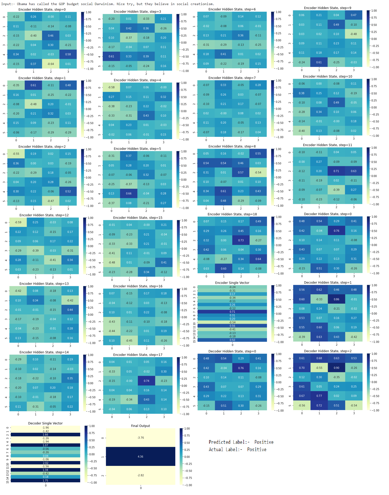
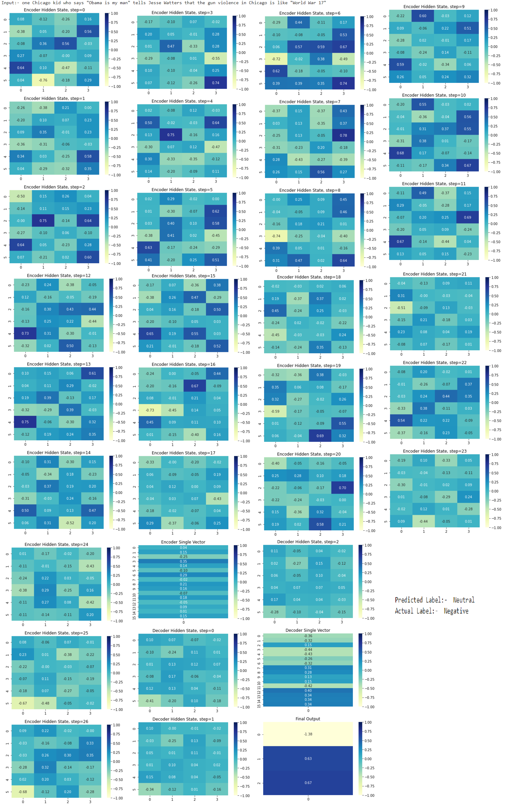

# Session 6 - LSTM Encoder Decoder Architecture on Tweet Dataset

## Objective

1.  _encoder:_ an  RNN/LSTM  layer takes the words in a sentence one by one and finally converts them into a single vector.
2.  this single vector is then sent to another RNN/LSTM that also takes the last prediction as its second input. Then we take the final vector from this Cell
3.  and send this final vector to a Linear Layer and make the final prediction.
4.  This is how it will look:
    1.  embedding
    2.  _word from a sentence +last hidden vector ->_ encoder  _-> single vector_
    3.  _single vector + last hidden vector -> decoder -> single vector_
    4.  _single vector -> FC layer -> Prediction_
    
    
## Solution
[](https://githubtocolab.com/pankaj90382/END-1.0/blob/main/S6/LSTM_Tweets.ipynb)

### Approach

#### LSTM vs LSTM Cell

LSTM is developed for easy use, but LSTMCell is developed for more delicate manipulation. They look quite similar in terms of parameters and outputs, but are different in many ways.First of all, you should be sure to know that LSTM assumes multiple steps of pre-defined length, which is different from LSTMCell’s single time step assumption. LSTMCell is useful when we do teacher forcing study or generate sequences based on the input at a current time step and the output of LSTM network at the previous time step.

![LSTM.png]
[]esource](https://medium.com/@kion.kim/lstm-vs-lstmcell-and-others-on-gluon-aac33f7b54ea)

In simple terms, the LSTM Cell provides two outputs for single time step. From any documentation they are written like this (hh,cc). The **CC** is Cell State or Context Vector whereas **hh** is known for h<sub>t</sub> as shown in fig. The inputs requires as **input_size, hidden_size** for the LSTM cell. The **input_size** of shape (batch, input) and **hidden_size**  consists of intial cell state and hidden state. Both having the size of (batch, hidden_size). Let's say our batch_size is 1 and embeding has 100 dimensions output, then the setntence *Obama has called the GOP budget social Darwinism. Nice try, but they believe in social creationism.* contains 19 vocabs (Words + special characters). Each of it becomes the size of 100 vector which will pass through the LSTM Cell. We need a loop to perform the time steps for a complete sentence. LSTM consists of all these things, so single line of instruction would do the work. I am using the LSTM Cell to perform the tweets analysis as the dataset is too small and single LSTM cell easily overfit this data.   

### Model

The model consists of three parts and follows the encoder-decoder architecture.
#### Encoder

The input_size is the embedding dimension. The hidden_size is a combination of cell_state (context vector) and hidden_state (h<sub>t</sub>). The seaborn plot the heatmap for each hidden state.

```python
class Encoder(nn.Module):
  def __init__(self, input_size, hidden_size):
    super().__init__()
    self.encoder = nn.LSTMCell(input_size, hidden_size, bias=False)
  def forward(self, x, mask, lengths, visualize=False):
      hidden_state, cell_state = mask
      for idx in range(lengths[0]):
        hidden_state, cell_state = self.encoder(x[0][idx].unsqueeze(0), (hidden_state, cell_state))
        if visualize:
          sns.heatmap(hidden_state[0].detach().numpy().reshape(-1, 4), fmt=".2f", vmin=-1, vmax=1, annot=True, cmap="YlGnBu").set(title=f"Encoder Hidden State, step={idx}")
          plt.show()
      return hidden_state, cell_state
```

#### Decoder

The input_size is the projecting dimension the same size as it comes from the encoder_single_vector. The hidden_size is a combination of cell_state (context vector) and hidden_state (h<sub>t</sub>) as the last output of hidden_state and cell_state from the encoder directly. The steps can be choosen according to the convience of user. I have choosed 3 as i have to predict the three classes as output. However, there is no correleation between these as user free to choose according to his/her own convience. The seaborn plot the heatmap for each hidden state.

```python
class Decoder(nn.Module):
  def __init__(self, emb_size, hidden_size):
    super().__init__()
    self.decoder = nn.LSTMCell(emb_size, hidden_size, bias=False)
  def forward(self, prev_embeded, encoder_hidden, visualize=False):
    hidden_state, cell = encoder_hidden
    max_steps = 3
    for idx in range(max_steps):
      hidden_state, cell = self.decoder(prev_embeded, (hidden_state, cell))
      if visualize:
        sns.heatmap(hidden_state[0].detach().numpy().reshape(-1, 4), fmt=".2f", vmin=-1, vmax=1, annot=True, cmap="YlGnBu").set(title=f"Decoder Hidden State, step={idx}")
        plt.show()
    return hidden_state, cell
```

#### Common Class
The embedding layer, encoder and decoder fully connected layer to convert to single vector, and final fully connected layter to predict the number of classes. In Last, the softmax to increase the value of prediction by exponentially lowering others. Used the fully connected layer on hidden_state to form into single vector with projection dimension as 16.

```python
class classifier(nn.Module):
    
    # Define all the layers used in model
    def __init__(self, vocab_size, embedding_dim, hidden_dim, output_dim, n_classes):
        
        super().__init__()          
        
        self.num_hidden_nodes = hidden_dim

        # Embedding layer
        self.embedding = nn.Embedding(vocab_size, embedding_dim)
        
        # LSTM layer
        self.encoder = Encoder(embedding_dim, hidden_dim)
        # try using nn.GRU or nn.RNN here and compare their performances
        # try bidirectional and compare their performances
        
        # Dense layer
        self.fc_encoder = nn.Linear(hidden_dim, output_dim, bias=False)

        self.decoder = Decoder(output_dim, hidden_dim)

        self.fc_decoder = nn.Linear(hidden_dim, output_dim, bias=False)

        self.fc_final = nn.Linear(output_dim, n_classes, bias=False)
        
    def forward(self, text, text_lengths, visualize=False):

        # text = [batch size, sent_length]
        embedded = self.embedding(text)
        # embedded = [batch size, sent_len, emb dim]

        inital_hidden = torch.randn(len(text), self.num_hidden_nodes,device=self.device)
        # (batch, hidden_size)
        inital_cell = torch.randn(len(text), self.num_hidden_nodes,device=self.device)
        
        hidden, cell = self.encoder(embedded, (inital_hidden, inital_cell), text_lengths, visualize)

        encoder_single_vector = self.fc_encoder(hidden)
        if visualize:
          sns.heatmap(encoder_single_vector[0].detach().numpy().reshape(-1, 1), fmt=".2f", vmin=-1, vmax=1, annot=True, cmap="YlGnBu").set(title=f"Encoder Single Vector")
          plt.show()
        # Hidden = [batch size, hid dim * num directions]
        hidden, cell = self.decoder(encoder_single_vector, (hidden, cell),visualize)  
        decoder_single_vector = self.fc_decoder(hidden)

        if visualize:
            sns.heatmap(decoder_single_vector[0].detach().numpy().reshape(-1, 1), fmt=".2f", vmin=-1, vmax=1, annot=True, cmap="YlGnBu").set(title=f"Decoder Single Vector")
            plt.show()
        # Final activation function softmax
        output = self.fc_final(decoder_single_vector)
        if visualize:
            sns.heatmap(output[0].detach().numpy().reshape(-1, 1), fmt=".2f", vmin=-1, vmax=1, annot=True, cmap="YlGnBu").set(title=f"Final Output")
            plt.show()
        output = F.softmax(output, dim=1)         
        return output
```

### Model Training

```
Train Loss: 0.957 | Train Acc: 61.95%
	 Val. Loss: 0.893 |  Val. Acc: 65.37% 

	Train Loss: 0.846 | Train Acc: 69.11%
	 Val. Loss: 0.874 |  Val. Acc: 64.88% 

	Train Loss: 0.813 | Train Acc: 72.22%
	 Val. Loss: 0.861 |  Val. Acc: 71.71% 

	Train Loss: 0.777 | Train Acc: 79.47%
	 Val. Loss: 0.829 |  Val. Acc: 72.68% 

	Train Loss: 0.733 | Train Acc: 81.71%
	 Val. Loss: 0.815 |  Val. Acc: 72.68% 

	Train Loss: 0.716 | Train Acc: 83.69%
	 Val. Loss: 0.808 |  Val. Acc: 73.66% 

	Train Loss: 0.708 | Train Acc: 84.81%
	 Val. Loss: 0.801 |  Val. Acc: 73.66% 

	Train Loss: 0.701 | Train Acc: 85.33%
	 Val. Loss: 0.798 |  Val. Acc: 75.61% 

	Train Loss: 0.696 | Train Acc: 85.50%
	 Val. Loss: 0.814 |  Val. Acc: 71.71% 

	Train Loss: 0.688 | Train Acc: 86.37%
	 Val. Loss: 0.800 |  Val. Acc: 75.61% 
  
  ```
### Results


#### Correctly-Classified Tweets


```
Input:- Obama has called the GOP budget social Darwinism. Nice try, but they believe in social creationism.
Predicted Label:-  Positive
Actual Label:-  Positive


Input:- In his teen years, Obama has been known to use marijuana and cocaine.
Predicted Label:-  Negative
Actual Label:-  Negative


Input:- IPA Congratulates President Barack Obama for Leadership Regarding JOBS Act WASHINGTON, Apr 05, 2012 (BUSINESS W... http//t.co/8le3DC8E
Predicted Label:-  Negative
Actual Label:-  Negative


Input:- @Professor_Why #WhatsRomneyHiding - his connection to supporters of Critical Race Theory.... Oh wait, that was Obama, not Romney...
Predicted Label:-  Negative
Actual Label:-  Negative


Input:- @wardollarshome Obama has approved more targeted assassinations than any modern US prez; READ &  http//t.co/bfC4gbBW
Predicted Label:-  Positive
Actual Label:-  Positive


Input:- Video shows federal officials joking about cost of lavish conference http//t.co/2i4SmoPM #obama #crime #p2 #news #tcot #teaparty
Predicted Label:-  Negative
Actual Label:-  Negative


Input:- @ohgirlphrase American kid "You're from the UK? Ohhh cool, So do you have tea with the Queen?". British kid "Do you like, go to Mcdonalds with Obama?
Predicted Label:-  Negative
Actual Label:-  Negative


Input:- President Obama &lt; Lindsay Lohan RUMORS beginning cross shape lights on ST &lt; 1987 Analyst64 DC bicycle courier &lt; Video changes to scramble.
Predicted Label:-  Negative
Actual Label:-  Negative


Input:- Obama's Gender Advantage Extends to the States - 2012 Decoded New detail on recent swing state polling further ... http//t.co/8iSanDGS
Predicted Label:-  Positive
Actual Label:-  Positive


Input:- Here's How Obama and the Democrats Will Win in 2012 Let's start by going back to the assorted polls questioning... http//t.co/zpg0TVm3
Predicted Label:-  Positive
Actual Label:-  Positive
```

#### Miss Correct Classified Tweets


```
Input:- one Chicago kid who says "Obama is my man" tells Jesse Watters that the gun violence in Chicago is like "World War 17"
Predicted Label:-  Neutral
Actual Label:-  Negative


Input:- A valid explanation for why Obama won't let women on the golf course.   #WhatsRomneyHiding
Predicted Label:-  Negative
Actual Label:-  Positive


Input:- #WhatsRomneyHiding? Obama's dignity and sense of humor? #p2 #tcot
Predicted Label:-  Negative
Actual Label:-  Neutral


Input:- RealClearPolitics - Obama's Organizational Advantage on Full ... As a small but electorally significant state t... http//t.co/3Ax22aBB
Predicted Label:-  Negative
Actual Label:-  Neutral


Input:- @wilycyotee Pres. Obama's ongoing support of women is another reason I am so proud he is my President!  @edshow #Obama2012
Predicted Label:-  Negative
Actual Label:-  Neutral


Input:- If Obama win 2012 Election wait til 2016 he will have full white hair! just like Bill clinton!
Predicted Label:-  Negative
Actual Label:-  Neutral


Input:- Even CBS won't buy bogus WH explanation of Obama Supreme Court comments - at http//t.co/rkNdEmIy #withnewt #tpn #tcot #tlot #tpp #sgp
Predicted Label:-  Negative
Actual Label:-  Positive


Input:- Obama And The Democrats Shocked By Constitutional Restraint http//t.co/RhSzoEU7 via @IBDinvestors
Predicted Label:-  Negative
Actual Label:-  Positive


Input:- #whatsObamahiding Kryptonite for the Grand Old Party! Obama 2012
Predicted Label:-  Negative
Actual Label:-  Positive


Input:- @BunkerBlast  @teacherspets Obama's Budget 'Interest Payments Will Exceed Defense Budget' in 2019  http//t.co/uddCXCjt
Predicted Label:-  Negative
Actual Label:-  Neutral
```

### Correctly Classified Encoding and Decoding States



### Miss-Correct Classified Encoding and Decoding States



## Refrences
 - [LSTM vs LSTMCell on Gluon](https://medium.com/@kion.kim/lstm-vs-lstmcell-and-others-on-gluon-aac33f7b54ea)
 - [LSTM cell to a Multilayer LSTM Network](https://towardsdatascience.com/from-a-lstm-cell-to-a-multilayer-lstm-network-with-pytorch-2899eb5696f3)
 - [PyTorch LSTM Cell Defination](https://pytorch.org/docs/stable/generated/torch.nn.LSTMCell.html)
 - [Carlos LSTM vs LSTM Cell Difference](https://github.com/CarlosJose126/RNNs/blob/main/LSTMCellvsLSTM.ipynb)
 - [Stackoverflow Discussion on LSTM Cell](https://stackoverflow.com/questions/57048120/pytorch-lstm-vs-lstmcell)
 
