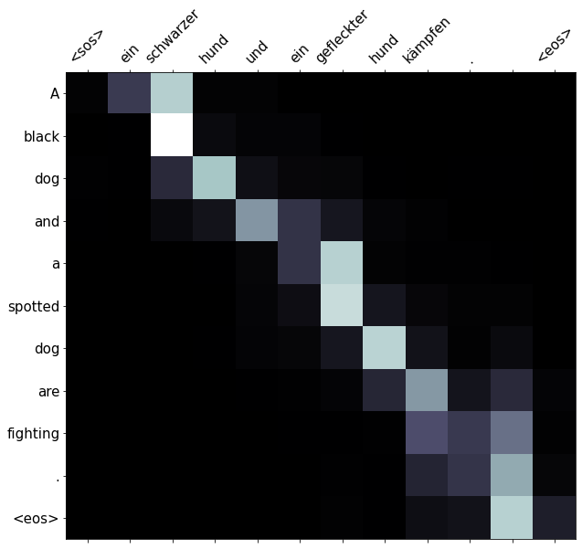
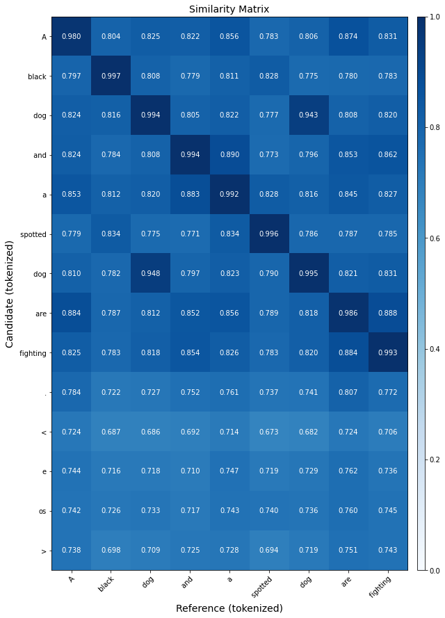
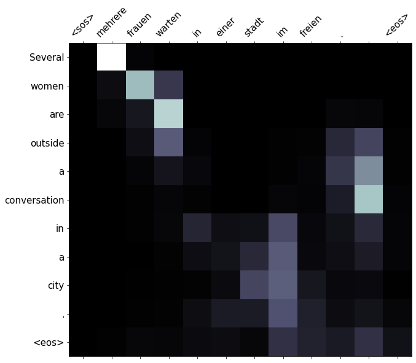
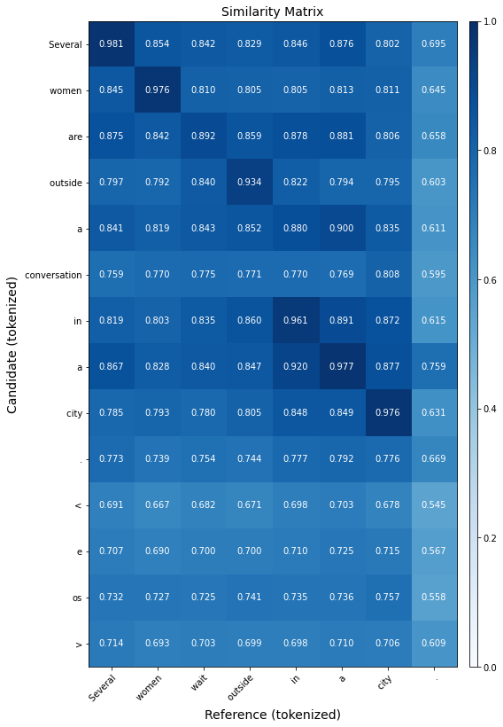
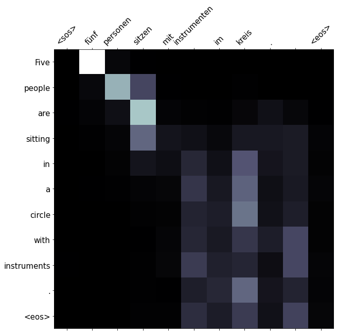
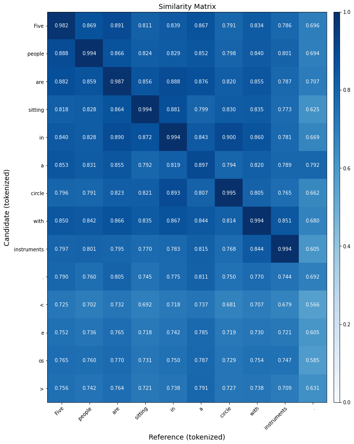

# Session 9 NLP Evaluation Metrics

## Objective
1.  Implement the following metrics (either on separate models or same, your choice):
    1.  Recall, Precision, and F1 Score
    2.  BLEU
    3.  Perplexity (explain whether you are using bigram, trigram, or something else, what does your PPL score represent?)
    4.  BERTScore (here are  [1 (Links to an external site.)](https://colab.research.google.com/drive/1kpL8Y_AnUUiCxFjhxSrxCsc6-sDMNb_Q)  [2 (Links to an external site.)](https://huggingface.co/metrics/bertscore)  examples)


## Solution

### Evaluation Metrics

Evalauation of machine learning model is one of the major part in building a machine learning model. 'Accuracy' is one of the most commonly used Evaluation metric in the classification problems, that is the total number of correct predictions by the total number of predictions.
Accuracy, Recall, Precision, and F1- Score are the key classification metrics.

#### Accuracy:

It is defined as percentage of total number of correct predictions to the total number of observations in the dataset. It can be easily calculated as total numer of correct predictions divided by total number of predictions.
<p align="center">
  
</p>
Where,<br>
TP => True Positive<br>
TN => True Negative<br>
FP => False Positive<br>
FN => False Negative<br>

#### Recall:
Recall is the percentage of relevant results that are correctly classified by the model, ie,it is the ratio of samples which were predicted to belong to a class with respect to all of the samples that truly belong in the class (predicted results).
<p align="center">
  
</p>

#### Precision
Precision is the percentage of relevant results, ie, it is the ratio of True Positives(TP) to all the positives in the dataset (actual results).
<p align="center">
  
</p>

#### F1 Score
F1 is the weighted average of precision and recall of the model. It gives more importance to the false positives and false negatives while not letting large numbers of true negatives influence the score. A good F1 score is when there are low false positives and low false negatives. The F1 score ranges from 0 to 1 and is considered perfect when it's 1.
<p align="center">
  
</p>
<br>It can also be written as
    <p align="center">
    
    </p>

#### BLEU Score
The BLEU (BiLingual Evaluation Understudy) score is a string-matching algorithm used for evaluating the quality of text which has been translated by a model from a language. The bleu metric ranges from 0 to 1 with 0 being the lowest score and 1 the highest. The closer the score is to 1, the more overlap there is with the reference translations. A higher score is also given to sequential matching words, ie, if a string of four words match the reference translation in the same exact order, it will have a more positive impact on the BLEU score than a string of two matching words.
There's this nice interpretation of BLEU Score from [Google Cloud](https://cloud.google.com/translate/automl/docs/evaluate)
| BLEU Score | Interpretation |
|--|--|
| < 10 | Almost useless
| 10 - 19 | Hard to get the gist
| 20 - 29 | The gist is clear, but has significant grammatical errors
| 30 - 40 | Understandable to good translations
| 40 - 50 | High quality translations
| 50 - 60 | Very high quality, adequate, and fluent translations
| > 60 | Quality often better than human

BLEU first makes n-grams (basically combine n words) from the predicted sentences and compare it with the n-grams of the actual target sentences. This matching is independent of the position of the n-gram. More the number of matches, more better the model is at translating.

#### Perplexity
 Perplexity is defined as a measurement of how well a probability distribution or probability model predicts a sample. A better language model will have lower perplexity values or higher probability values for a test/valid set. It is also defined as exponential average negative log-likelihood of a sequence.<br>
  If we have a tokenized sequence X = (x0,x1,x2,...,xt) then the perplexity of X is:  
 <p align="center">
  
</p>

### BERTScore


BertScore basically addresses two common pitfalls in n-gram-based metrics. Firstly, the n-gram models fail to robustly match paraphrases which leads to performance underestimation when semantically-correct phrases are penalized because of their difference from the surface form of the reference. BertScore is a metric used for evaluating the text generated by a model. It computes a similarity score for each token in the predicted sentence with each token in the reference sentence using the contextual embeddings from the BERT model and generates scores in three common metrics- precision, recall and F1 measure.
    

### Text Classification Model and Evaluation
[](https://githubtocolab.com/pankaj90382/END-1.0/blob/main/S9/END2_LSTM.ipynb)

**Dataset** - IMDB

| Model | Precision | Recall | F1 |
|--|--|--|--|
| LSTM | 0.81 | 0.91 | 0.86

#### Logs

```
Epoch: 05 | Epoch Time: 0m 41s
	Train Loss: 0.596 | Train Acc: 69.23%
	 Val. Loss: 0.509 |  Val. Acc: 78.57%
+--------------------+-----------------+-----------------+
|       Train        | Actual Positive | Actual Negative |
+--------------------+-----------------+-----------------+
| Predicted Positive |       6243      |       2712      |
| Predicted Negative |       3159      |       6636      |
+--------------------+-----------------+-----------------+
+--------------------+-----------------+-----------------+
|       Valid        | Actual Positive | Actual Negative |
+--------------------+-----------------+-----------------+
| Predicted Positive |       2273      |       613       |
| Predicted Negative |       825       |       2539      |
+--------------------+-----------------+-----------------+
+-----------+--------+--------+
|  Metrics  | Train  | Valid  |
+-----------+--------+--------+
|    Loss   | 0.596  | 0.509  |
|  Accuracy | 68.69% | 76.99% |
| Precision |  0.70  |  0.79  |
|   Recall  |  0.66  |  0.73  |
|  F1 score |  0.68  |  0.76  |
+-----------+--------+--------+
Epoch: 06 | Epoch Time: 0m 41s
	Train Loss: 0.522 | Train Acc: 76.02%
	 Val. Loss: 0.483 |  Val. Acc: 80.20%
+--------------------+-----------------+-----------------+
|       Train        | Actual Positive | Actual Negative |
+--------------------+-----------------+-----------------+
| Predicted Positive |       7056      |       2249      |
| Predicted Negative |       2346      |       7099      |
+--------------------+-----------------+-----------------+
+--------------------+-----------------+-----------------+
|       Valid        | Actual Positive | Actual Negative |
+--------------------+-----------------+-----------------+
| Predicted Positive |       2102      |       343       |
| Predicted Negative |       996       |       2809      |
+--------------------+-----------------+-----------------+
+-----------+--------+--------+
|  Metrics  | Train  | Valid  |
+-----------+--------+--------+
|    Loss   | 0.522  | 0.483  |
|  Accuracy | 75.49% | 78.58% |
| Precision |  0.76  |  0.86  |
|   Recall  |  0.75  |  0.68  |
|  F1 score |  0.75  |  0.76  |
+-----------+--------+--------+
Epoch: 07 | Epoch Time: 0m 41s
	Train Loss: 0.450 | Train Acc: 80.36%
	 Val. Loss: 0.663 |  Val. Acc: 76.31%
+--------------------+-----------------+-----------------+
|       Train        | Actual Positive | Actual Negative |
+--------------------+-----------------+-----------------+
| Predicted Positive |       7421      |       1806      |
| Predicted Negative |       1981      |       7542      |
+--------------------+-----------------+-----------------+
+--------------------+-----------------+-----------------+
|       Valid        | Actual Positive | Actual Negative |
+--------------------+-----------------+-----------------+
| Predicted Positive |       2969      |       1448      |
| Predicted Negative |       129       |       1704      |
+--------------------+-----------------+-----------------+
+-----------+--------+--------+
|  Metrics  | Train  | Valid  |
+-----------+--------+--------+
|    Loss   | 0.450  | 0.663  |
|  Accuracy | 79.80% | 74.77% |
| Precision |  0.80  |  0.67  |
|   Recall  |  0.79  |  0.96  |
|  F1 score |  0.80  |  0.79  |
+-----------+--------+--------+
Epoch: 08 | Epoch Time: 0m 41s
	Train Loss: 0.434 | Train Acc: 81.33%
	 Val. Loss: 0.389 |  Val. Acc: 85.50%
+--------------------+-----------------+-----------------+
|       Train        | Actual Positive | Actual Negative |
+--------------------+-----------------+-----------------+
| Predicted Positive |       7614      |       1821      |
| Predicted Negative |       1788      |       7527      |
+--------------------+-----------------+-----------------+
+--------------------+-----------------+-----------------+
|       Valid        | Actual Positive | Actual Negative |
+--------------------+-----------------+-----------------+
| Predicted Positive |       2626      |       543       |
| Predicted Negative |       472       |       2609      |
+--------------------+-----------------+-----------------+
+-----------+--------+--------+
|  Metrics  | Train  | Valid  |
+-----------+--------+--------+
|    Loss   | 0.434  | 0.389  |
|  Accuracy | 80.75% | 83.76% |
| Precision |  0.81  |  0.83  |
|   Recall  |  0.81  |  0.85  |
|  F1 score |  0.81  |  0.84  |
+-----------+--------+--------+
Epoch: 09 | Epoch Time: 0m 41s
	Train Loss: 0.372 | Train Acc: 85.03%
	 Val. Loss: 0.370 |  Val. Acc: 86.60%
+--------------------+-----------------+-----------------+
|       Train        | Actual Positive | Actual Negative |
+--------------------+-----------------+-----------------+
| Predicted Positive |       8059      |       1576      |
| Predicted Negative |       1343      |       7772      |
+--------------------+-----------------+-----------------+
+--------------------+-----------------+-----------------+
|       Valid        | Actual Positive | Actual Negative |
+--------------------+-----------------+-----------------+
| Predicted Positive |       2759      |       608       |
| Predicted Negative |       339       |       2544      |
+--------------------+-----------------+-----------------+
+-----------+--------+--------+
|  Metrics  | Train  | Valid  |
+-----------+--------+--------+
|    Loss   | 0.372  | 0.370  |
|  Accuracy | 84.43% | 84.85% |
| Precision |  0.84  |  0.82  |
|   Recall  |  0.86  |  0.89  |
|  F1 score |  0.85  |  0.85  |
+-----------+--------+--------+
Epoch: 10 | Epoch Time: 0m 41s
	Train Loss: 0.325 | Train Acc: 87.19%
	 Val. Loss: 0.371 |  Val. Acc: 86.86%
+--------------------+-----------------+-----------------+
|       Train        | Actual Positive | Actual Negative |
+--------------------+-----------------+-----------------+
| Predicted Positive |       8146      |       1262      |
| Predicted Negative |       1256      |       8086      |
+--------------------+-----------------+-----------------+
+--------------------+-----------------+-----------------+
|       Valid        | Actual Positive | Actual Negative |
+--------------------+-----------------+-----------------+
| Predicted Positive |       2821      |       655       |
| Predicted Negative |       277       |       2497      |
+--------------------+-----------------+-----------------+
+-----------+--------+--------+
|  Metrics  | Train  | Valid  |
+-----------+--------+--------+
|    Loss   | 0.325  | 0.371  |
|  Accuracy | 86.57% | 85.09% |
| Precision |  0.87  |  0.81  |
|   Recall  |  0.87  |  0.91  |
|  F1 score |  0.87  |  0.86  |
+-----------+--------+--------+
```
#### Infrences

In the Epoch 5 to 10, the Precision, Recall, Accuracy and F1 Score increases which indicates the model is learning the dataset epoch by epoch. A high precision rate of 0.81 signififes a low False Positive rate and a high recall of 0.91 suggests that the model has a low False Negative rate. Since both the precision and recall have high scores, we can conclude that the model is returning accurate results as well as returning a majority of the positive results.

A F1 score of 0.86 signifies a low number of False positives and False negatives, that is, the model has a hgh recall and precision score. Hence the model is able to correctly label most of the positive samples successfully.

#### Examples

```python
predict_sentiment(model, "This film is terrible")
neg
predict_sentiment(model, "This film is great")
pos
```
### Language Translation Model and Evaluation
[](https://githubtocolab.com/pankaj90382/END-1.0/blob/main/S9/4%20-%20Packed%20Padded%20Sequences%2C%20Masking%2C%20Inference%20and%20BLEU.ipynb)

**Dataset:** [Multi30k](https://github.com/multi30k/dataset)

| Model | PPL | BLEU Score | BERT Score |
|--|--|--|--|
| Seq2Seq w/ Attention | 38.691 | 28.9395 | P=0.932 R=0.931 F1=0.931 |

#### Logs

```
Epoch: 07 | Time: 3m 57s
	Train Loss: 1.887 | Train PPL:   6.597
	 Val. Loss: 3.583 |  Val. PPL:  35.987 | BLEU. Score : 0.273213 | BERT. P-Score : 0.926 | BERT. R-Score : 0.926 | BERT. F1-Score : 0.926
Epoch: 08 | Time: 3m 43s
	Train Loss: 1.687 | Train PPL:   5.405
	 Val. Loss: 3.655 |  Val. PPL:  38.657 | BLEU. Score : 0.281270 | BERT. P-Score : 0.928 | BERT. R-Score : 0.928 | BERT. F1-Score : 0.928
Epoch: 09 | Time: 3m 15s
	Train Loss: 1.531 | Train PPL:   4.624
	 Val. Loss: 3.667 |  Val. PPL:  39.130 | BLEU. Score : 0.284322 | BERT. P-Score : 0.930 | BERT. R-Score : 0.929 | BERT. F1-Score : 0.930
Epoch: 10 | Time: 3m 10s
	Train Loss: 1.403 | Train PPL:   4.068
	 Val. Loss: 3.693 |  Val. PPL:  40.167 | BLEU. Score : 0.280844 | BERT. P-Score : 0.929 | BERT. R-Score : 0.929 | BERT. F1-Score : 0.929
	 
| Test Loss: 3.656 | Test PPL:  38.691 | BLEU. Score : 0.289395 | BERT. P-Score : 0.932 | BERT. R-Score : 0.931 | BERT. F1-Score : 0.931 
```

#### Examples

```
src = Ein schwarzer Hund und ein gefleckter Hund kämpfen.
trg = A black dog and a spotted dog are fighting
predicted trg = ['A', 'black', 'dog', 'and', 'a', 'spotted', 'dog', 'are', 'fighting', '.', '<eos>']
```
| Attention | Similarity Matrix |
|--|--|
| |  |


```
src = Mehrere Frauen warten in einer Stadt im Freien.
trg = Several women wait outside in a city.
predicted trg = ['Several', 'women', 'are', 'outside', 'a', 'conversation', 'in', 'a', 'city', '.', '<eos>']
```
| Attention | Similarity Matrix |
|--|--|
| |  |

```

src = Fünf Personen sitzen mit Instrumenten im Kreis.
trg = Five people are sitting in a circle with instruments.
predicted trg = ['Five', 'people', 'are', 'sitting', 'in', 'a', 'circle', 'with', 'instruments', '.', '<eos>']
```

| Attention | Similarity Matrix |
|--|--|
| |  |

#### Infrences

The PPL calculated for this model was in Unigram, which was $38.691$ for test set, this would be interpreted as the model has to choose among $~38$ possible options of words to predict the next outcome.<br>
We got a BLEU Score of `28.9395`, so it comes under "Understandable to good translation", and it is ! Note that this score was got from using unigram, bigram and trigram and 4-gram of the corpuses.<br>
Each token in `x` is matched to the most similar token in  and vice-versa for calculating Recall and Precision respectively. The matching is greedy and isolated. Precision and Recall are combined for calculating the F1 score. The Scores we get are relative to BERT model performing on the dataset. We get a score of `0.932` pretty good ? too good to be true ? yes could be, but the test dataset has only 1K samples.
